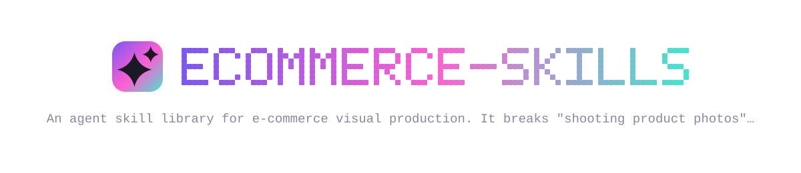

[中文](README.md) · English

# ecommerce-skills

[](https://github.com/dlazy-ai/ecommerce-skills/actions/workflows/ci.yml)
[](LICENSE)
[](https://github.com/asale-ai/repolish)

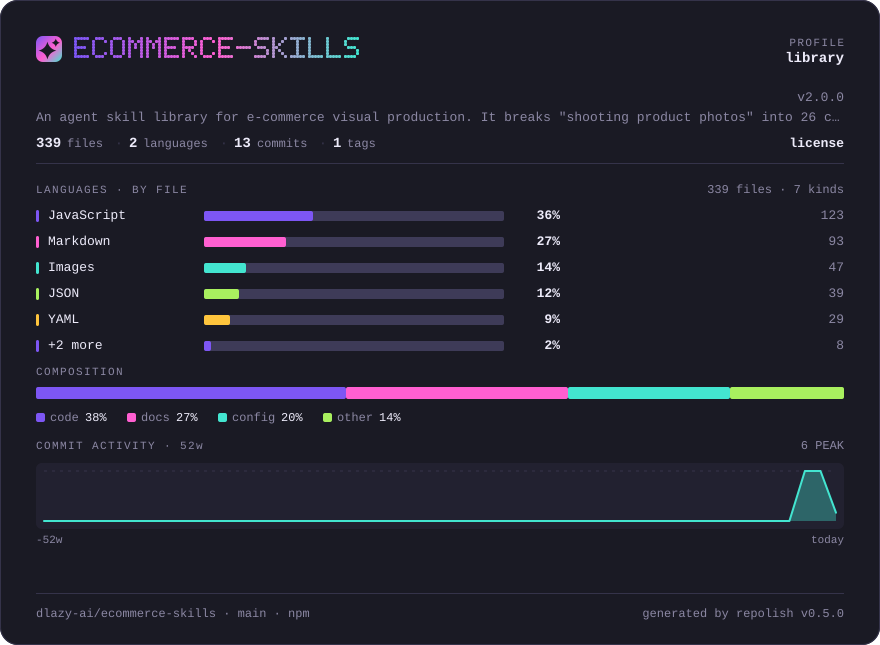


An agent skill library for **e-commerce visual production**. It breaks "shooting product
photos" into 26 composable skills. Each skill is an executable `skill.md` with bundled
scripts, and the whole thing runs on top of swappable image / video / text model backends.

Flat-lay → on-model shot → variant set → detail page → main-image video → AI QC →
marketplace compliance. No studio, no model booking. What makes this different from a
pile of prompts:

- **No vendor lock-in.** dLazy is the default, but OpenAI, Gemini, fal, Replicate and Volcengine Ark all work with your own key. With no key at all, `--dry-run` still shows you exactly what would be sent and what it would cost.
- **Deterministic work belongs in scripts.** Batching, retries, resume, cost caps, compliance checks and the QC loop are code — not something the model re-improvises on every run.
- **It can be verified.** Marketplace image specs are checked against pixels, not vibes.

---

## Examples

Every group below is a **real run**: inputs on the left, the actual generated output on the right —
not a mockup. Each command reproduces its result verbatim and is folded under the images.
The same example is also inlined at the top of each `skills/<name>/skill.md`.

### On-model — put the product on a person

#### [flat-lay](skills/flat-lay/skill.md) — Garment flat-lay → on-model catalog shot

<table><tr>
<td align="center" valign="bottom"><br><sub>input · garment flat-lay, 800×800</sub></td>
<td align="center" valign="bottom"><br><sub>input · pose reference, 768×1024</sub></td>
<td align="center" valign="bottom"><br><sub>output · 1024×1536 · 60 credits</sub></td>
</tr></table>

Cable stitch, diamond jacquard, drop-shoulder cut, ribbed cuffs and the woven cuff label all survive. Pose, crop, lighting and the light-grey wall are copied from the reference.

<details>
<summary>Reproducible command</summary>

```bash
dlazy gpt-image-2 \
  --prompt 'E-commerce on-model product photography. Image 1 is the garment flat-lay: an olive-green cable-knit crewneck sweater. Image 2 is the pose/scene reference. Dress the model from image 2 in the garment from image 1, replacing the grey T-shirt. Keep the garment 100% faithful: identical olive-green color, cable-knit and diamond texture, oversized drop-shoulder fit, ribbed collar and cuffs, and the small woven label on the right cuff. Reproduce the reference exactly for pose, camera angle, crop, body proportions, lighting and the plain light-grey studio wall background. Photorealistic full-frame catalog shot, sharp fabric detail, natural soft light, no text or watermark.' \
  --images docs/flat-lay/garment-flatlay.jpg docs/flat-lay/pose-reference.jpg \
  --size 1024x1536 --quality high --imageFormat jpeg \
  --save docs/flat-lay/example-output.jpg
```

</details>

#### [wear-everything](skills/wear-everything/skill.md) — Shoes / bags / accessories worn by a real model

<table><tr>
<td align="center" valign="bottom">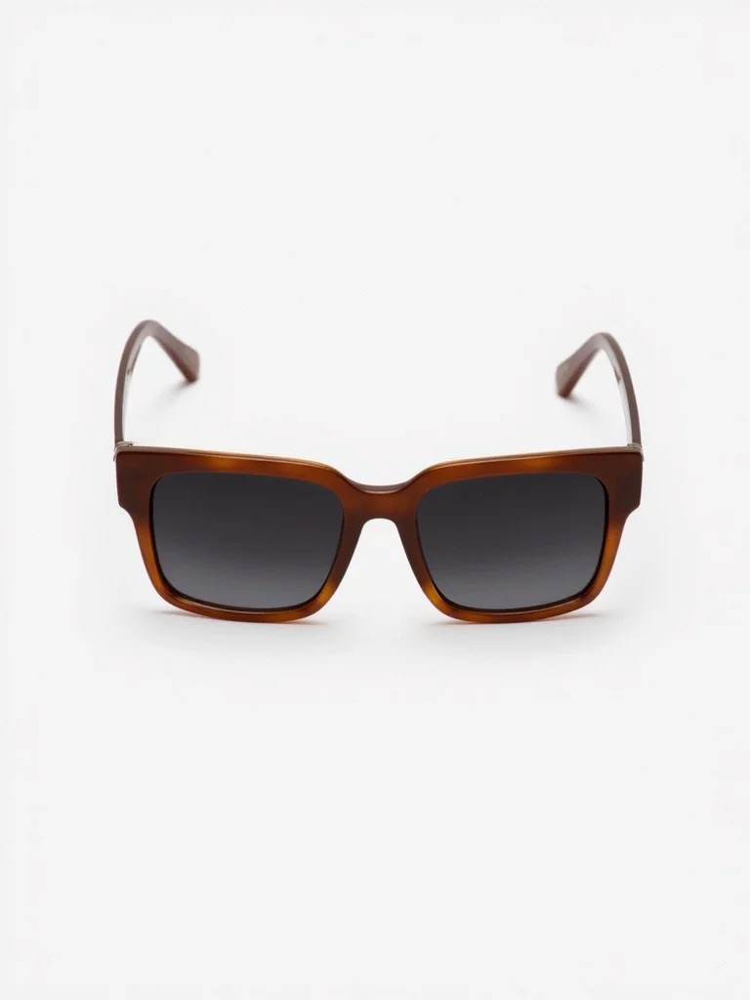<br><sub>input · tortoise rectangular sunglasses, 768×1024</sub></td>
<td align="center" valign="bottom">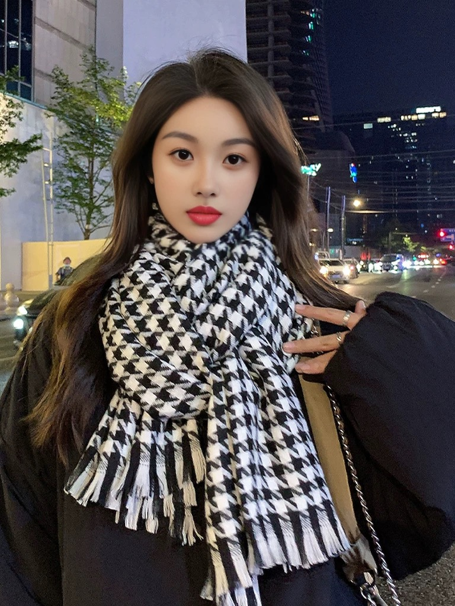<br><sub>input · night-street model reference, 768×1024</sub></td>
<td align="center" valign="bottom">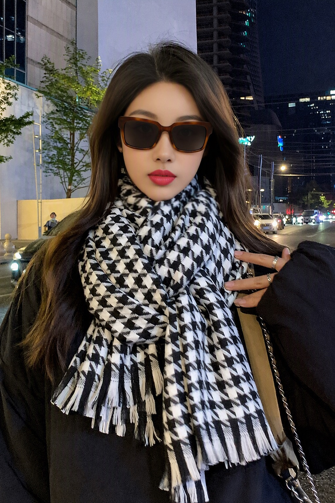<br><sub>output · 1024×1536</sub></td>
</tr></table>

The glasses sit correctly on the nose bridge and ears; frame grain and lens tint are preserved. Face, houndstooth scarf, night street and colour grade stay untouched.

<details>
<summary>Reproducible command</summary>

```bash
dlazy gpt-image-2 \
  --prompt 'On-model accessory product photography. Image 1 is the product: a pair of tortoise-brown rectangular sunglasses with dark grey lenses. Image 2 is the model/scene reference. Put the sunglasses from image 1 onto the face of the model in image 2, correctly seated on the nose bridge and ears with natural perspective, realistic lens reflections and a soft shadow on the cheekbones. Keep the product 100% faithful: identical frame shape, tortoise-brown acetate color and grain, hinge and temple design, lens tint. Change nothing else — face, hair, scarf, coat, bag chain, night street background, colour grading and crop must stay pixel-identical to image 2. Photorealistic, no text, no watermark.' \
  --images docs/wear-everything/product-sunglasses.jpg docs/wear-everything/model-reference.jpg \
  --size 1024x1536 --quality medium --imageFormat jpeg \
  --save docs/wear-everything/example-output.jpg
```

</details>

#### [image-fusion](skills/image-fusion/skill.md) — Up to 8 separate items → one complete styled look

<table><tr>
<td align="center" valign="bottom"><br><sub>input 1 · cable-knit sweater</sub></td>
<td align="center" valign="bottom"><br><sub>input 2 · woven bucket hat</sub></td>
<td align="center" valign="bottom"><br><sub>input 3 · pearl necklace</sub></td>
<td align="center" valign="bottom"><br><sub>output · 3:4 / 2K · 5 credits</sub></td>
</tr></table>

All three items land at once with their texture, colourway and bead size intact; the trousers and shoes nobody supplied are filled in exactly as the prompt specifies.

<details>
<summary>Reproducible command</summary>

```bash
dlazy seedream-5.0 \
  --prompt '电商搭配商拍图。将参考图中的多件单品组合到同一个模特身上：图1 的军绿色麻花针织圆领毛衣作为上装，图2 的彩色编织渔夫帽戴在头上，图3 的珍珠项链戴在颈部。每件单品必须与参考图完全一致——颜色、织法纹理、图案、材质与细节都不能改。下装自动补一条米白色阔腿长裤，脚穿白色运动鞋。青年亚洲女模特，正面站姿，全身入画，纯浅灰色摄影棚背景，柔和顶光，真实照片质感，无文字无水印。' \
  --images docs/image-fusion/item-sweater.jpg docs/image-fusion/item-hat.jpg docs/image-fusion/item-necklace.jpg \
  --size 3:4 --resolution 2k \
  --save docs/image-fusion/example-output.jpg
```

</details>

### One image into many

#### [one-shot](skills/one-shot/skill.md) — Swap model / background, keep the garment

<table><tr>
<td align="center" valign="bottom">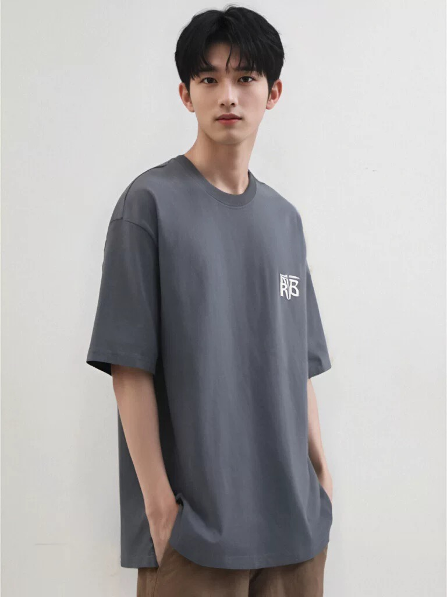<br><sub>input · source on-model shot, 768×1024</sub></td>
<td align="center" valign="bottom">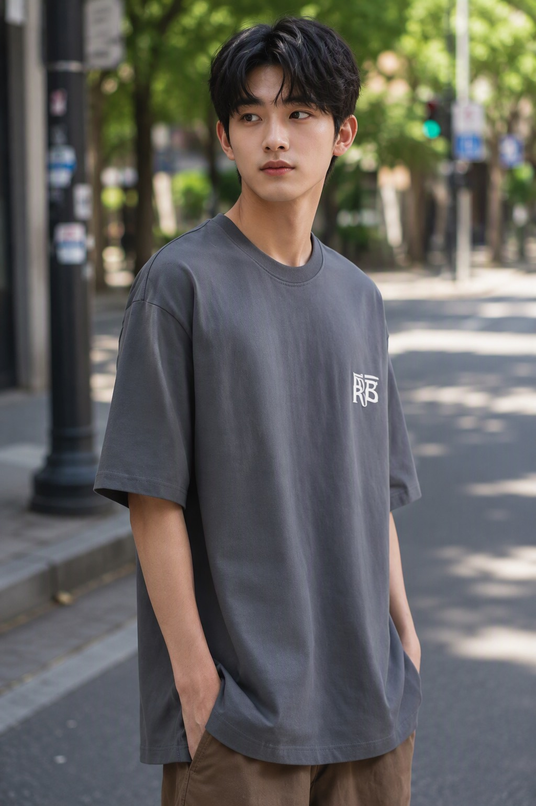<br><sub>output · 1024×1536</sub></td>
</tr></table>

The grey drop-shoulder tee keeps its colour, cut, chest logo and hem curve. The person becomes a different model and the studio wall becomes a dappled city street, at the same pose and crop.

<details>
<summary>Reproducible command</summary>

```bash
dlazy gpt-image-2 \
  --prompt 'Replace the model and the background of this e-commerce photo while keeping the garment untouched. Keep the grey oversized short-sleeve T-shirt exactly as it is: same slate-grey colour, same drop-shoulder cut, same white chest logo, same folds and hem. Replace the person with a different male model of similar build and age, and replace the plain studio wall with a sunlit outdoor city street with soft bokeh. Keep the same pose, camera angle, crop and framing. Photorealistic catalog shot, natural light, no text, no watermark.' \
  --images docs/one-shot/source-model.jpg \
  --size 1024x1536 --quality medium --imageFormat jpeg \
  --save docs/one-shot/example-output.jpg
```

</details>

#### [fission-pattern](skills/fission-pattern/skill.md) — One product image → a full variant set

<table><tr>
<td align="center" valign="bottom"><br><sub>input · product shot</sub></td>
<td align="center" valign="bottom"><br><sub>output 1 · hero shot</sub></td>
<td align="center" valign="bottom"><br><sub>output 2 · in-use lifestyle</sub></td>
<td align="center" valign="bottom"><br><sub>output 3 · macro detail</sub></td>
</tr></table>

The product-fidelity paragraph is word-for-word identical across all three; only the camera paragraph changes — blueprint with cool side light / cafe table with warm window light / hard-lit dial macro. The command below is set image 2.

<details>
<summary>Reproducible command (set image 2)</summary>

```bash
dlazy gpt-image-2 \
  --prompt 'E-commerce product photography, set image 2 of 3 — in-use lifestyle shot. The subject is the watch from the reference image: a polished stainless-steel watch with a silver sunburst dial, applied baton markers and a black crocodile-embossed leather strap. Keep the product 100% faithful: same case shape and polish, same dial colour and marker layout, same hand shapes, same crown, same strap embossing and stitching — it must be recognisably the identical watch as the reference. Show it worn on a man wrist resting on a wooden cafe table beside a white coffee cup, dark suit sleeve and white shirt cuff visible, warm window light, shallow depth of field with a blurred cafe background. Photorealistic, no text, no watermark.' \
  --images docs/fission-pattern/product-watch.jpg \
  --size 1024x1536 --quality medium --imageFormat jpeg \
  --save docs/fission-pattern/example-output-2.jpg
```

</details>

#### [item-detail](skills/item-detail/skill.md) — Detail-page modules with typeset Chinese copy

<table><tr>
<td align="center" valign="bottom">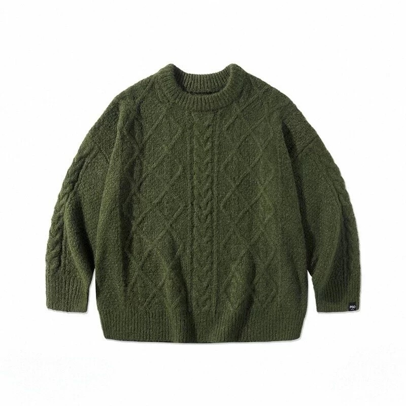<br><sub>input · product flat-lay, 800×800</sub></td>
<td align="center" valign="bottom">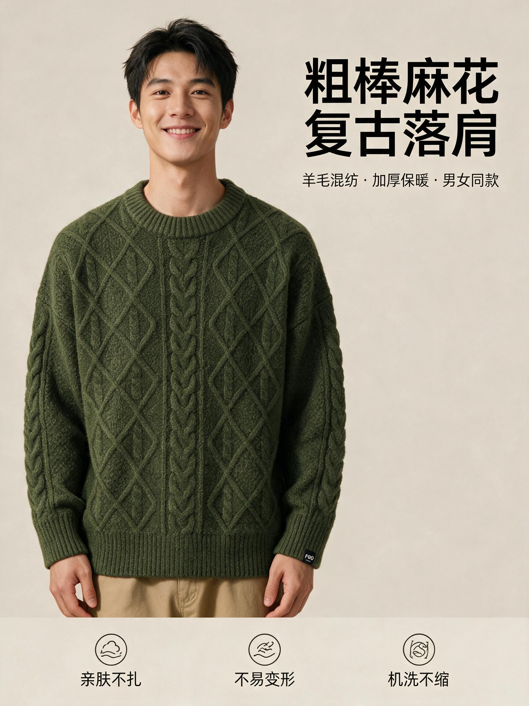<br><sub>output · 3:4 / 2K · 5 credits</sub></td>
</tr></table>

On-model shot on the left with the olive colour and stitch pattern intact; headline and sub-headline on the upper right render as correct, properly-hierarchied Chinese glyphs; three line icons with feature copy along the bottom, all aligned on a warm greige ground.

<details>
<summary>Reproducible command (hero banner module)</summary>

```bash
dlazy seedream-5.0-pro \
  --prompt '电商服饰详情页首屏 banner，竖版。左侧是图1 中的军绿色麻花针织圆领毛衣的模特上身图（青年男模特，半身，落肩宽松版型），毛衣颜色、麻花织法与菱形提花必须与图1一致。右上方留白区排版中文标题，大字「粗棒麻花 复古落肩」，副标题小字「羊毛混纺 · 加厚保暖 · 男女同款」。底部一行三个圆形图标配文字「亲肤不扎」「不易变形」「机洗不缩」。整体米灰色背景，暖色调，留白克制，字体为无衬线黑体，排版整齐对齐，商业电商详情页设计感，中文字必须清晰正确无乱码。' \
  --images docs/item-detail/product-flatlay.jpg --size 3:4 \
  --save docs/item-detail/example-output.jpg
```

</details>

### From scratch

#### [creative-scene](skills/creative-scene/skill.md) — Text → image, plus pose / styling retargeting

<table><tr>
<td align="center" valign="bottom">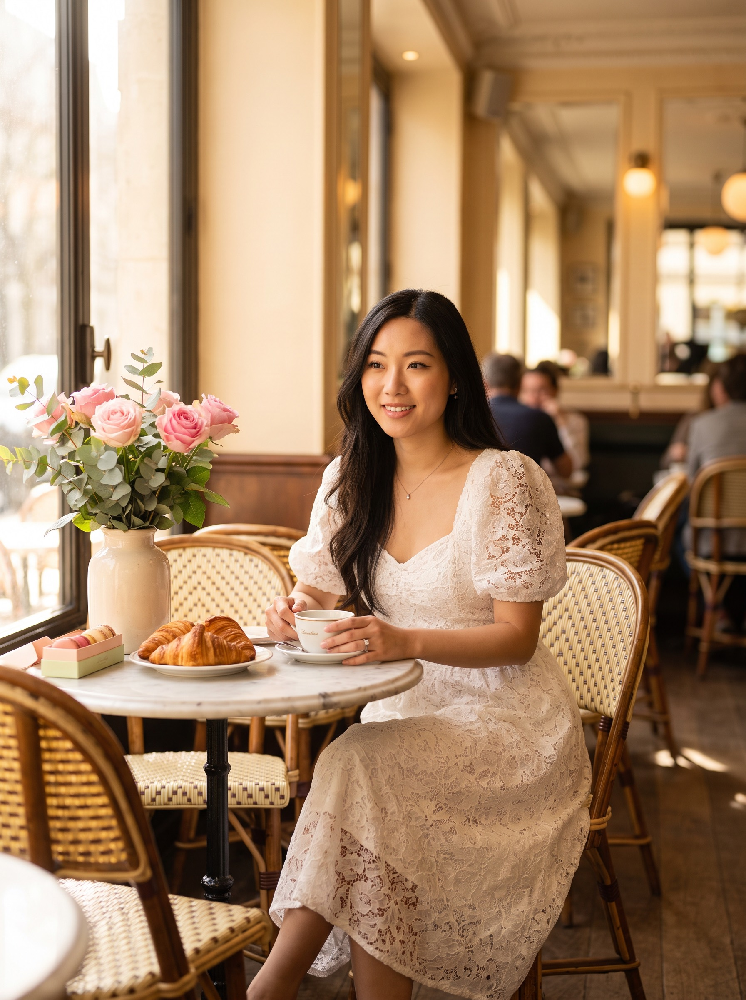<br><sub>output · 3:4 / 2K · 18 credits</sub></td>
</tr></table>

No input asset — one sentence. Subject, outfit, French-cafe setting, three-quarter waist-up framing and the warm-white grade all land as described; the skill's five slots (subject / outfit / scene / framing / mood) each own one clause. The result can be fed straight back in as the input for a targeted edit.

<details>
<summary>Reproducible command</summary>

```bash
dlazy banana-pro \
  --prompt 'A long-haired young Asian woman wearing a white puff-sleeve lace midi dress, sitting at a marble table inside a French-style cafe, fresh flowers and pastries arranged on the table, warm white colour grading, soft window light, front three-quarter view, waist-up framing, atmospheric editorial portrait, photorealistic, shot on 85mm, shallow depth of field, no text, no watermark.' \
  --aspectRatio 3:4 --imageSize 2K \
  --save docs/creative-scene/example-output.jpg
```

</details>

### Scale and quality control

#### [batch-image](skills/batch-image/skill.md) — CSV-driven batch pipeline

<table><tr>
<td align="center" valign="bottom"><br><sub>input · SKU001 sweater</sub></td>
<td align="center" valign="bottom"><br><sub>input · SKU002 derby shoes</sub></td>
<td align="center" valign="bottom">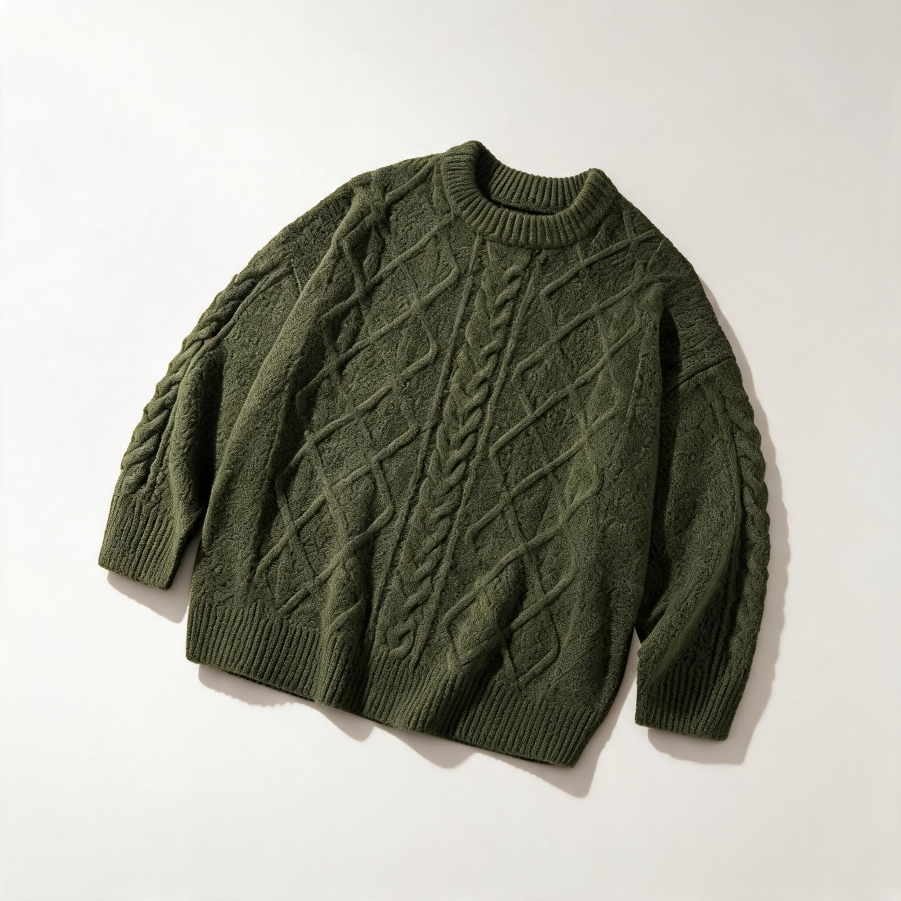<br><sub>output · 1:1 / 2K · 5 credits</sub></td>
<td align="center" valign="bottom">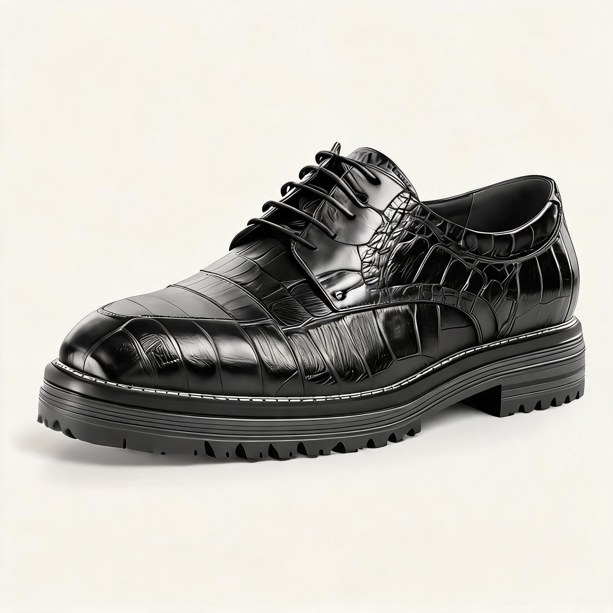<br><sub>output · 1:1 / 2K · 5 credits</sub></td>
</tr></table>

Background, light position, angle and shadow direction match across both, because the spec paragraph is word-for-word identical; each product stays faithful to its own source. 100 SKUs is this loop 100 times, roughly 500 credits.

<details>
<summary>Reproducible command</summary>

```bash
for sku in a-sweater b-shoes; do
  case $sku in
    a-sweater) DESC='军绿色麻花针织圆领毛衣，落肩宽松版型' ;;
    b-shoes)   DESC='黑色亮面皮革布洛克德比鞋，厚底系带' ;;
  esac
  dlazy seedream-5.0 \
    --prompt "电商商拍图。图1 是商品：${DESC}。商品的颜色、材质纹理、款式细节必须与图1完全一致。放置在同一套统一视觉里：纯米白色摄影棚背景，柔和顶光加左侧补光，45 度视角，画面下方留出统一的商品投影，构图与留白在整组图中保持一致。真实商业产品摄影，无文字无水印。" \
    --images docs/batch-image/sku-${sku}.jpg --size 1:1 --resolution 2k \
    --save docs/batch-image/example-output-${sku}.jpg
done
```

</details>

#### [detect-task](skills/detect-task/skill.md) — Pre-launch AI-image QC

<table><tr>
<td align="center" valign="bottom">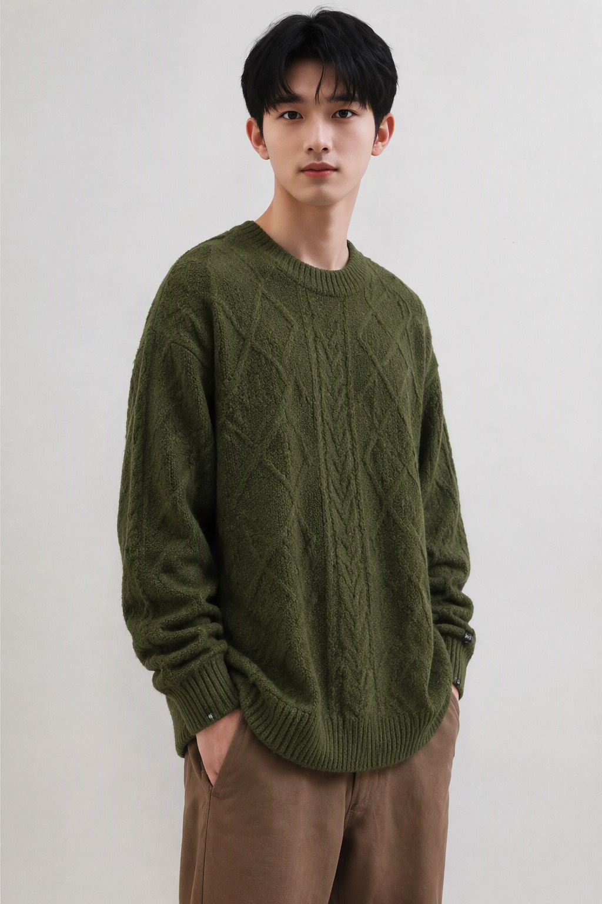<br><sub>input · candidate (the flat-lay output)</sub></td>
</tr></table>

The output is a report, not an image. 3 credits, [full report here](docs/detect-task/example-report.md). Summary:

- **Risk level**: low
- **8 checks**: 7 pass; `garbled text` hits (minor) — the woven cuff label is illegible
- **Recommendation**: manual retouch (a local fix on the cuff label only)
- **Prompt fix**: `clear and legible brand tag/logo embroidery on cuff, sharp fine detail, no blurry or garbled text`

That sentence appends straight onto the original flat-lay prompt for a rerun — that is the loop.

<details>
<summary>Reproducible command</summary>

```bash
dlazy claude-sonnet-5 \
  --prompt '你是电商投放前的图片质检员。审查这张 AI 生成的服装商拍图能否直接用于电商投放。全部用中文作答（第 4 项的 prompt 修正句除外）。严格按以下结构输出：
## 1. 风险等级
低风险 / 中风险 / 高风险（三选一）
## 2. 风险项逐条判定
用表格输出，三列：风险项 / 结论（通过 或 命中）/ 证据。风险项固定为这 8 条：商品崩坏、人脸不自然、手部异常、肢体结构错误、文字乱码、光影矛盾、边缘融合痕迹、平台合规。
## 3. 投放建议
建议投放 / 建议重跑 / 建议人工修图
## 4. 修正建议
若建议重跑或人工修图，给出应追加到生成 prompt 的英文修正句 1-3 条；若建议投放，写「无需修正」。
只输出报告，不要寒暄。' \
  --images docs/detect-task/candidate.jpg \
  | python3 -c 'import sys,json;print(json.load(sys.stdin)["result"]["data"]["texts"][0])' \
  > docs/detect-task/example-report.md
```

</details>

### Single-purpose edits

#### [to-3d](skills/to-3d/skill.md) — Flat-lay → ghost-mannequin 3D shot

<table><tr>
<td align="center" valign="bottom"><br><sub>input · flat-lay, 800×800</sub></td>
<td align="center" valign="bottom">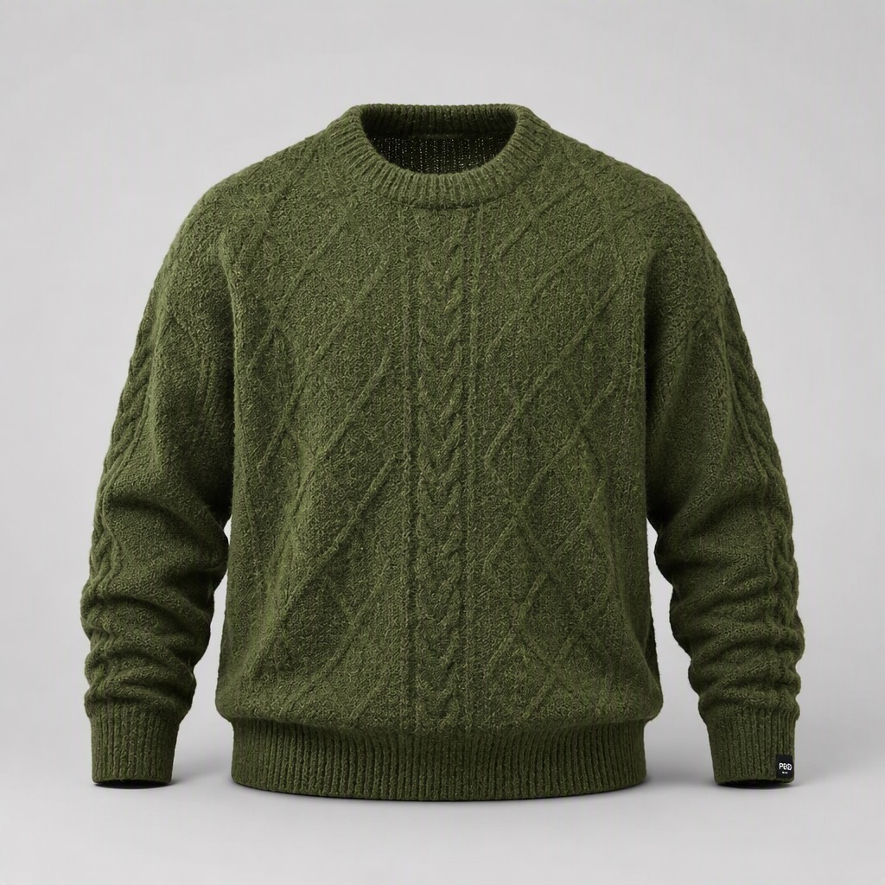<br><sub>output · 1024×1024</sub></td>
</tr></table>

Shoulders and chest fill out, sleeves bend naturally, the collar opens to show the inner ribbing and back lining, and the hem casts its own shadow — with no mannequin or body anywhere in frame.

<details>
<summary>Reproducible command</summary>

```bash
dlazy gpt-image-2 \
  --prompt 'Turn this flat-lay garment photo into a dimensional 3D ghost-mannequin product shot. The olive-green cable-knit crewneck sweater must gain realistic volume: filled shoulders and chest, sleeves with natural bend, visible interior of the collar, soft self-shadow under the hem, as if worn by an invisible mannequin. Keep the garment 100% faithful: same olive-green colour, same cable-knit and diamond stitch pattern, same ribbed collar and cuffs, same woven cuff label. Clean seamless light-grey studio background, soft top light, sharp fibre detail. No mannequin, no person, no text.' \
  --images docs/to-3d/garment-flatlay.jpg \
  --size 1024x1024 --quality medium --imageFormat jpeg \
  --save docs/to-3d/example-output.jpg
```

</details>

#### [clothing-extraction](skills/clothing-extraction/skill.md) — Any photo → clean product flat-lay

<table><tr>
<td align="center" valign="bottom">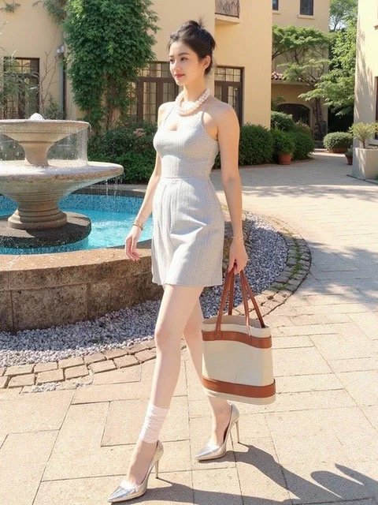<br><sub>input · street-style photo, 480×640</sub></td>
<td align="center" valign="bottom">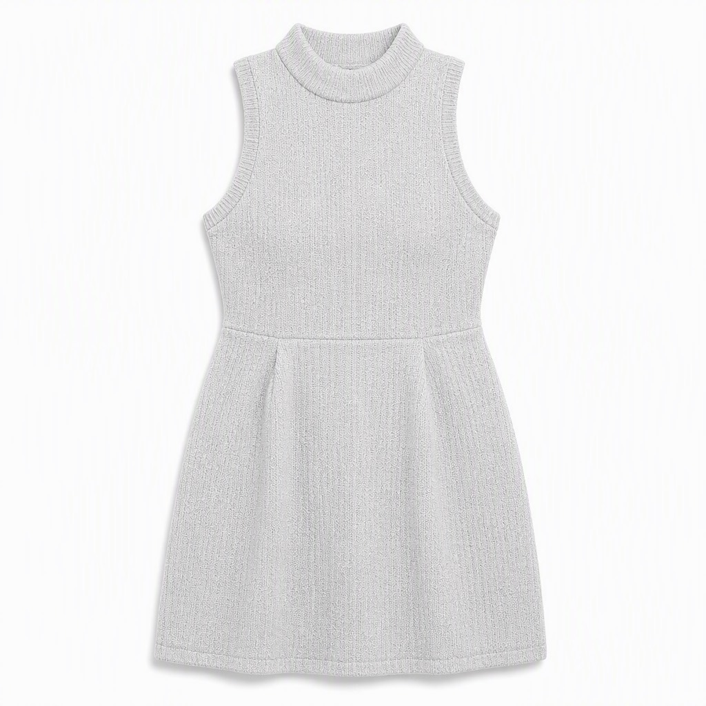<br><sub>output · 1024×1024</sub></td>
</tr></table>

Model, necklace, tote, heels and the fountain background are all gone, leaving only the dress — laid flat, centred, symmetric, with the mock neckline, armholes, waist seam and hem length reconstructed from the original.

<details>
<summary>Reproducible command</summary>

```bash
dlazy gpt-image-2 \
  --prompt 'Extract the garment worn by the model in this photo and render it as a clean e-commerce flat-lay. Output only the light-grey textured sleeveless knit mini dress with the mock neckline, laid flat and centred, front view, symmetric, fully unoccluded — remove the model, the pearl necklace, the tote bag, the shoes, the fountain and the whole background. Keep the garment 100% faithful: same light-grey colour, same knit texture, same neckline and armhole shape, same waist seam and hem length. Pure white seamless background, even soft studio light, subtle contact shadow. No person, no props, no text.' \
  --images docs/clothing-extraction/source-photo.jpg \
  --size 1024x1024 --quality medium --imageFormat jpeg \
  --save docs/clothing-extraction/example-output.jpg
```

</details>

#### [fabric-on-body](skills/fabric-on-body/skill.md) — Swap the fabric, keep the pattern

<table><tr>
<td align="center" valign="bottom"><br><sub>input · style sheet, 800×800</sub></td>
<td align="center" valign="bottom">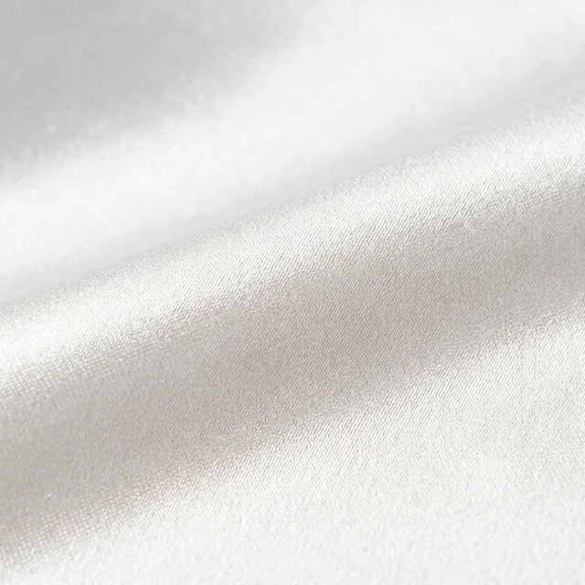<br><sub>input · ivory silk satin swatch</sub></td>
<td align="center" valign="bottom">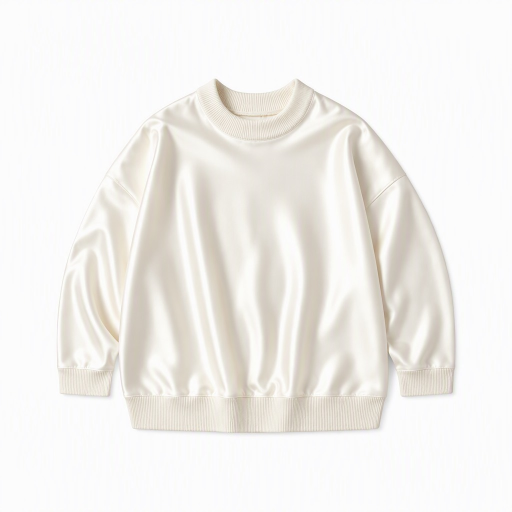<br><sub>output · 1024×1024</sub></td>
</tr></table>

Drop-shoulder cut, body and sleeve length, collar/cuff/hem construction and the flat-lay angle all match the style sheet; only the material changes — chunky knit becomes ivory silk satin, with specular highlights on the folds and a softer drape.

<details>
<summary>Reproducible command</summary>

```bash
dlazy gpt-image-2 \
  --prompt 'Fabric replacement for a garment style sheet. Image 1 is the garment pattern/style reference: an oversized drop-shoulder crewneck sweater with ribbed collar, cuffs and hem. Image 2 is the target fabric: ivory silk satin with a soft lustrous sheen and fine weave. Re-render the exact same garment silhouette from image 1 in the fabric from image 2. Keep the pattern identical: same oversized drop-shoulder cut, same body length, same sleeve length, same collar/cuff/hem construction, same flat-lay layout and camera angle. Replace only the material — the sweater must now read as ivory silk satin with specular highlights on the folds and soft drape instead of chunky knit. Clean white background, even studio light, no text.' \
  --images docs/fabric-on-body/style-sheet.jpg docs/fabric-on-body/fabric-swatch.jpg \
  --size 1024x1024 --quality medium --imageFormat jpeg \
  --save docs/fabric-on-body/example-output.jpg
```

</details>

#### [clothing-detail](skills/clothing-detail/skill.md) — Macro detail shot for a detail page

<table><tr>
<td align="center" valign="bottom"><br><sub>input · garment flat-lay, 800×800</sub></td>
<td align="center" valign="bottom">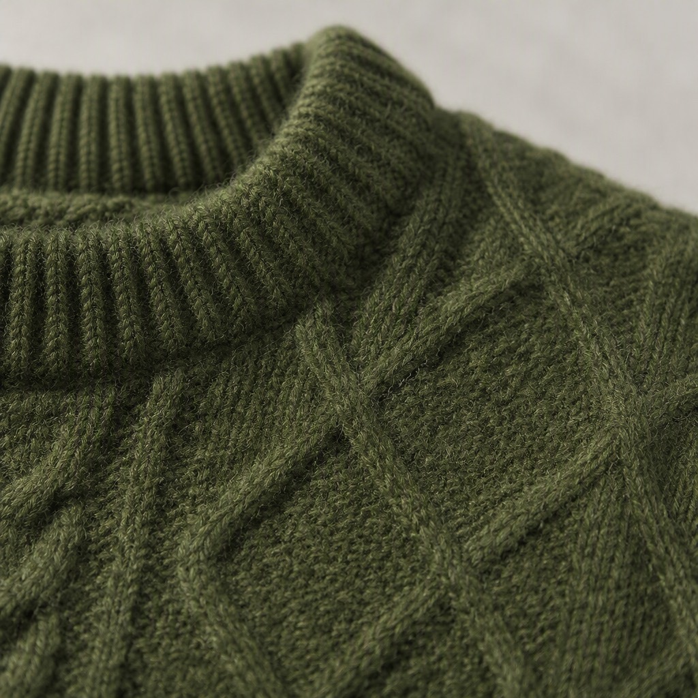<br><sub>output · 1024×1024 · 60 credits</sub></td>
</tr></table>

The join between the ribbed collar and the cable panel, the twist of individual yarn plies and the loft of the wool fibres all resolve; raking light makes the diamond jacquard read in relief, with the far edge falling into soft bokeh.

<details>
<summary>Reproducible command</summary>

```bash
dlazy gpt-image-2 \
  --prompt 'Macro detail shot for an e-commerce detail page. Zoom into the shoulder-and-collar area of this olive-green cable-knit sweater and render a photorealistic close-up that fills the frame. Show the ribbed crewneck collar meeting the raglan-style cable panel, individual yarn plies and the twist of the cable braid, the loft of the wool fibres, and soft directional light raking across the surface to reveal depth. Keep the colour and stitch pattern exactly as in the source. Shallow depth of field with the far edge softly out of focus, clean neutral background bokeh, no person, no text, no watermark.' \
  --images docs/clothing-detail/garment-flatlay.jpg \
  --size 1024x1024 --quality high --imageFormat jpeg \
  --save docs/clothing-detail/example-output.jpg
```

</details>

#### [clothing-grass-planting](skills/clothing-grass-planting/skill.md) — Same outfit, new model / scene / pose

<table><tr>
<td align="center" valign="bottom"><br><sub>input · source outfit</sub></td>
<td align="center" valign="bottom">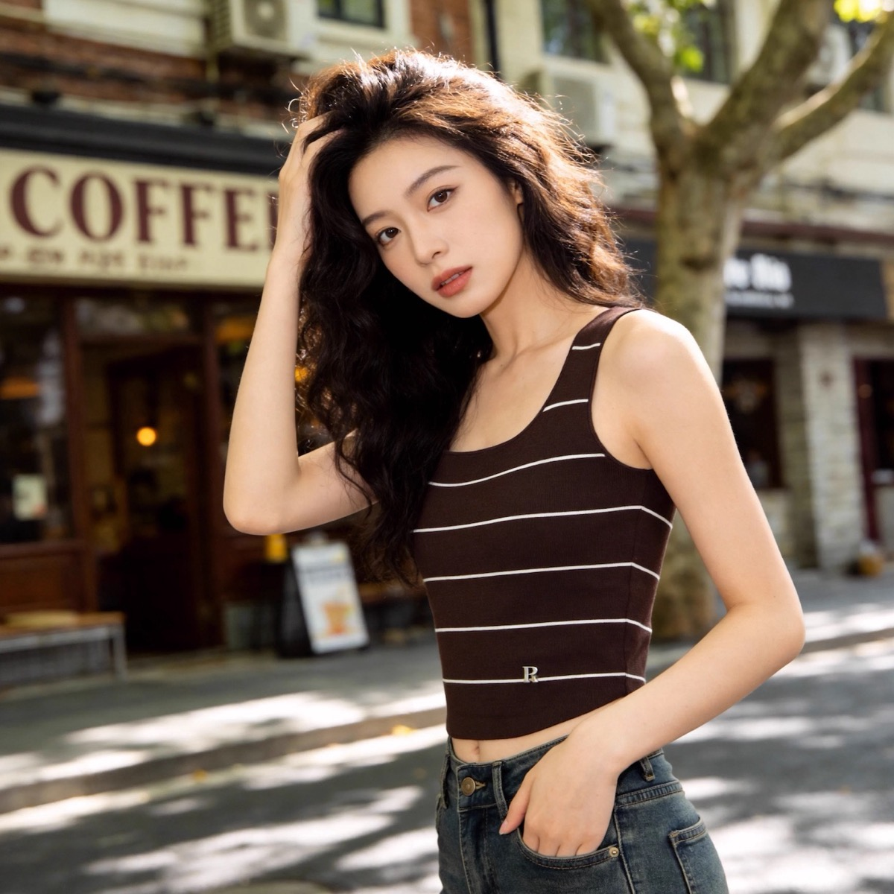<br><sub>input · scene & model reference</sub></td>
<td align="center" valign="bottom">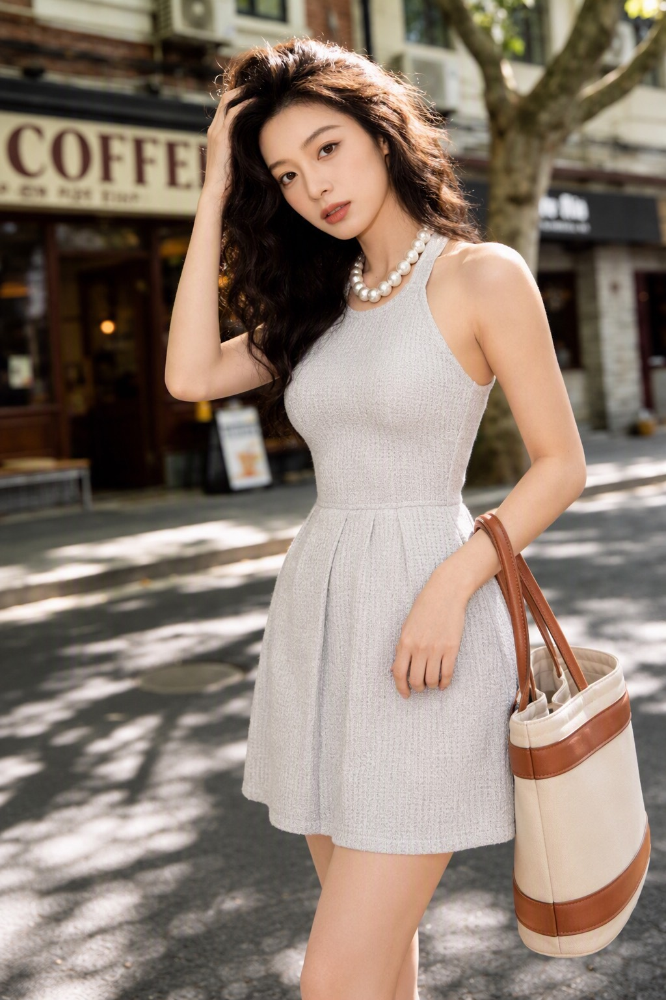<br><sub>output · 1024×1536</sub></td>
</tr></table>

The dress's grey knit texture, mock neckline, waist and hem, the pearl choker's bead size and the tote's cream/tan colour blocking all carry over; model, hand-in-hair pose, cafe street, dappled warm light and shallow depth of field come from the reference.

<details>
<summary>Reproducible command</summary>

```bash
dlazy gpt-image-2 \
  --prompt 'Lifestyle social-commerce photo. Image 1 shows the outfit to keep: a light-grey textured sleeveless knit mini dress with a mock neckline, a pearl choker, a cream-and-tan tote bag and silver pointed heels. Image 2 is the model, pose, scene and lighting reference: a young woman on a sunlit tree-lined street outside a coffee shop, hand in her hair, warm dappled daylight, shallow depth of field. Put the complete outfit from image 1 onto the model from image 2. Keep every garment detail faithful: same grey knit texture, same neckline and hem length, same pearl choker, same tote bag colour blocking. Reproduce image 2 for the model identity, pose, camera angle, crop, street background and colour grading. Photorealistic influencer-style photo, no text, no watermark.' \
  --images docs/clothing-grass-planting/source-outfit.jpg docs/clothing-grass-planting/scene-reference.jpg \
  --size 1024x1536 --quality medium --imageFormat jpeg \
  --save docs/clothing-grass-planting/example-output.jpg
```

</details>

#### [item-selling-point](skills/item-selling-point/skill.md) — Product shot → converting main image with copy

<table><tr>
<td align="center" valign="bottom">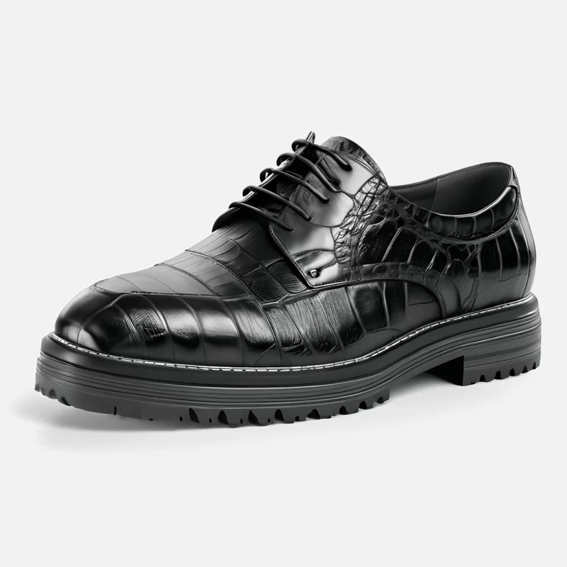<br><sub>input · product shot, 800×800</sub></td>
<td align="center" valign="bottom">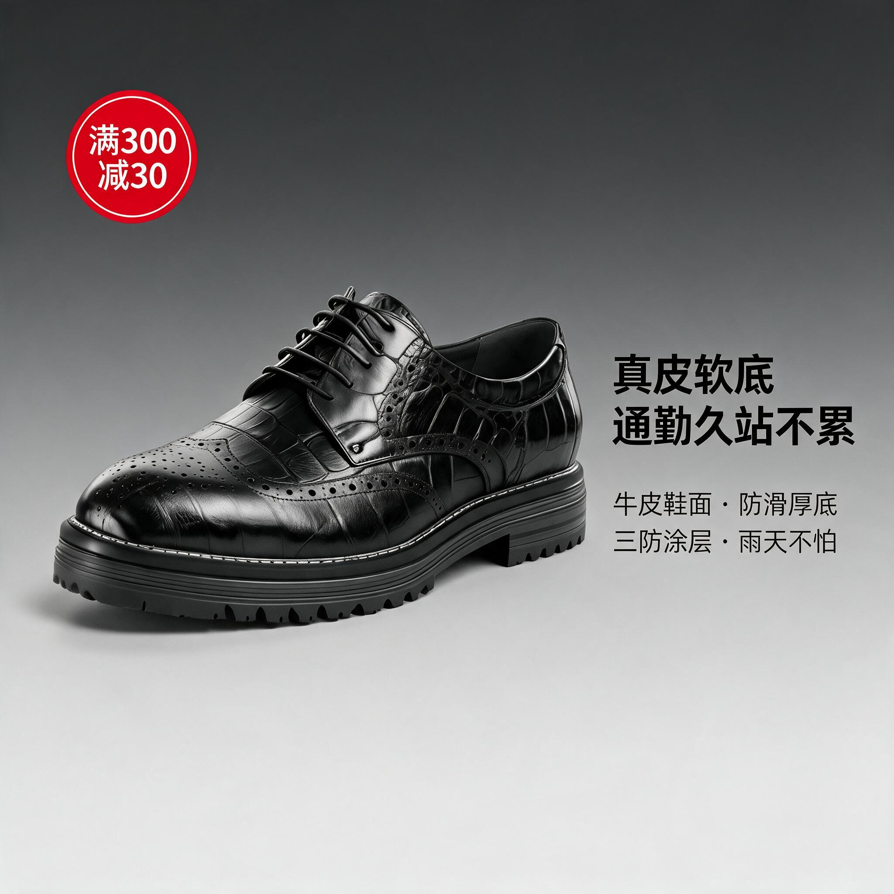<br><sub>output · 1:1 / 2048×2048 · 5 credits</sub></td>
</tr></table>

Croc embossing, brogue perforations, laces and the lug sole stay identical; the product is cut out and set left of centre with a soft shadow, a correctly-typeset Chinese headline and two feature lines run down the right, and a red promo badge sits top-left.

<details>
<summary>Reproducible command</summary>

```bash
dlazy seedream-5.0-pro \
  --prompt '电商正方形主图。主体是图1 中的黑色亮面皮革布洛克德比鞋，鞋型、雕花孔、鞋带与厚底必须与图1完全一致，商品去底后放在画面中央偏左，下方带柔和投影。背景为深灰到浅灰渐变，右侧竖排中文卖点文案：主标题大字「真皮软底 通勤久站不累」，下方两行小字卖点「牛皮鞋面 · 防滑厚底」「三防涂层 · 雨天不怕」。左上角一枚红色圆形促销角标写「满300减30」。无衬线黑体，字号层级分明，排版整齐，中文字清晰正确无乱码，商业电商主图设计。' \
  --images docs/item-selling-point/product-shoes.jpg --size 1:1 \
  --save docs/item-selling-point/example-output.jpg
```

</details>

#### [item-change-background](skills/item-change-background/skill.md) — Product → photorealistic lifestyle scene

<table><tr>
<td align="center" valign="bottom"><br><sub>input · white-background product shot, 800×800</sub></td>
<td align="center" valign="bottom">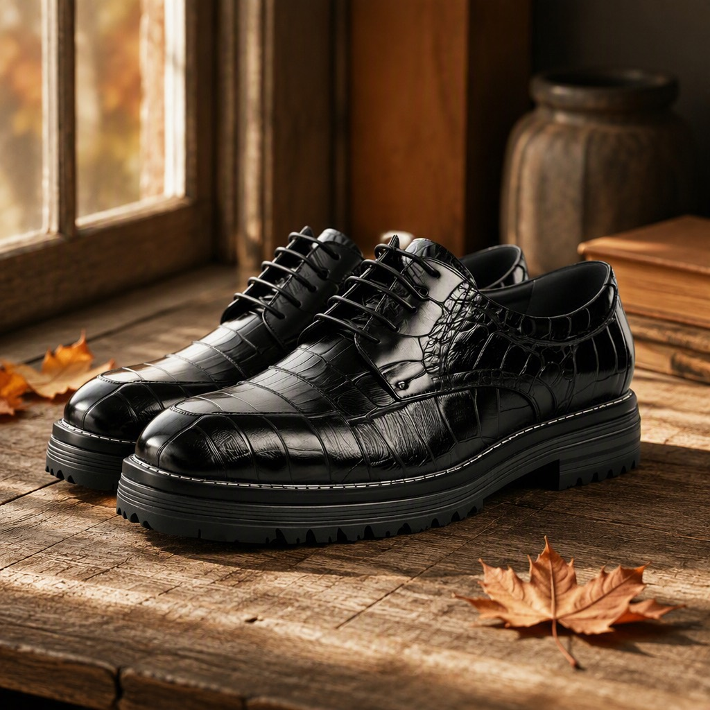<br><sub>output · 1024×1024</sub></td>
</tr></table>

Croc embossing, brogue perforations, the white welt stitching and the lug sole are unchanged; the background becomes weathered wood by a window with maple leaves, late-afternoon side light glinting off each toe, correct contact shadows, and the wood's warmth faintly reflected in the patent leather.

<details>
<summary>Reproducible command</summary>

```bash
dlazy gpt-image-2 \
  --prompt 'Place this product into a photorealistic lifestyle scene. Keep the pair of black patent leather derby shoes 100% faithful: same glossy patent finish, same brogue perforation pattern, same lacing, same chunky lug sole, same proportions and camera angle. Replace the plain background with a warm autumn scene: a weathered wooden floor beside a window, a few dry maple leaves, soft late-afternoon side light casting a natural contact shadow under each shoe, blurred indoor background. The shoes must sit believably on the surface with correct perspective and grounded shadows. Photorealistic commercial product photography, no text, no watermark.' \
  --images docs/item-change-background/product-shoes.jpg \
  --size 1024x1024 --quality medium --imageFormat jpeg \
  --save docs/item-change-background/example-output.jpg
```

</details>

#### [remove-watermark](skills/remove-watermark/skill.md) — Remove watermarks and promotional text

<table><tr>
<td align="center" valign="bottom"><br><sub>input · promo image with frame, copy and badges</sub></td>
<td align="center" valign="bottom">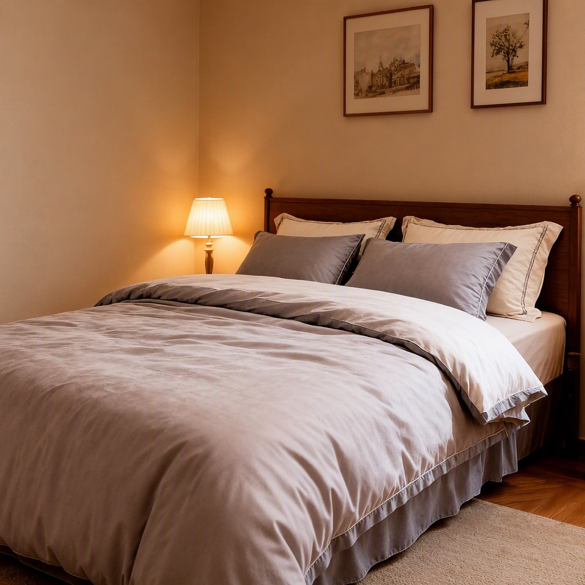<br><sub>output · 1024×1024</sub></td>
</tr></table>

Frame, headline, date line, price bubble, coupon banner and corner badge are all gone; wall, headboard, floor and bedding continue seamlessly with no ghosted letterforms. Room, bedding palette, lamp and wall art are kept.

> Note: compare against the source and the room's perspective has shifted slightly — that is normal for reconstruction rather than pixel-level patching. Use a dedicated retouching tool when the original pixels must be preserved exactly.

<details>
<summary>Reproducible command</summary>

```bash
dlazy gpt-image-2 \
  --prompt 'Remove every piece of text, price tag, badge, ribbon and decorative promotional frame from this image, and reconstruct what was behind them. Delete the red-and-gold border frame, the large headline, the date line, the price bubble with the number, the coupon banner and the bottom-right colour label. Keep the photograph itself completely unchanged: same bedroom, same bed, same taupe and cream bedding set, same table lamp, same wall art, same perspective, same colour grading and same resolution. Inpaint the cleared areas so the room continues naturally — walls, headboard, floor and bedding must look seamless, with no ghosting, blur patches or leftover letter shapes. Clean product photo, absolutely no text.' \
  --images docs/remove-watermark/source-watermarked.jpg \
  --size 1024x1024 --quality medium --imageFormat jpeg \
  --save docs/remove-watermark/example-output.jpg
```

</details>

#### [material-enhancement](skills/material-enhancement/skill.md) — Texture enhancement from a hi-res reference

<table><tr>
<td align="center" valign="bottom"><br><sub>input · on-model shot to improve, 1024×1536</sub></td>
<td align="center" valign="bottom"><br><sub>input · hi-res product reference, 800×800</sub></td>
<td align="center" valign="bottom">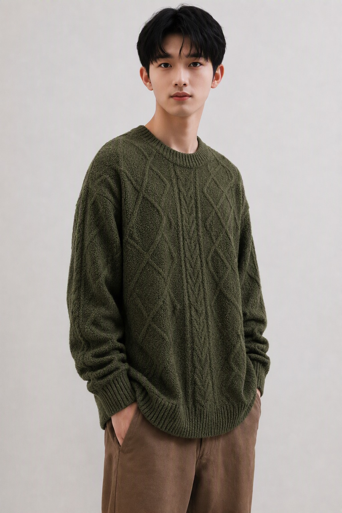<br><sub>output · 1024×1536 · 60 credits</sub></td>
</tr></table>

Cable relief, jacquard depth, wool loft and the shadow gradation inside the folds are rebuilt; face, hair, hands, pose, trousers, wall and overall grade stay identical, and neither the silhouette nor the olive colour shifts.

<details>
<summary>Reproducible command</summary>

```bash
dlazy gpt-image-2 \
  --prompt 'Texture enhancement pass. Image 1 is the on-model photo to improve. Image 2 is the high-resolution product photo that defines the true fabric. Rebuild the sweater surface in image 1 using the real texture from image 2: crisp cable-braid relief, visible knit loops and yarn twist, natural wool loft, correct fold shadows and a matte fibre sheen. Do not change anything else — the model face, hair, hands, pose, brown trousers, background, framing and colour grading must stay identical to image 1. The garment silhouette and colour must not shift; only the material fidelity and micro-detail improve. Photorealistic, sharp, no text, no watermark.' \
  --images docs/material-enhancement/source-image.jpg docs/material-enhancement/hires-product.jpg \
  --size 1024x1536 --quality high --imageFormat jpeg \
  --save docs/material-enhancement/example-output.jpg
```

</details>

#### [item-repair](skills/item-repair/skill.md) — Snapshot → listing-ready retouch

<table><tr>
<td align="center" valign="bottom"><br><sub>input · wrinkled flat-lay, 800×800</sub></td>
<td align="center" valign="bottom">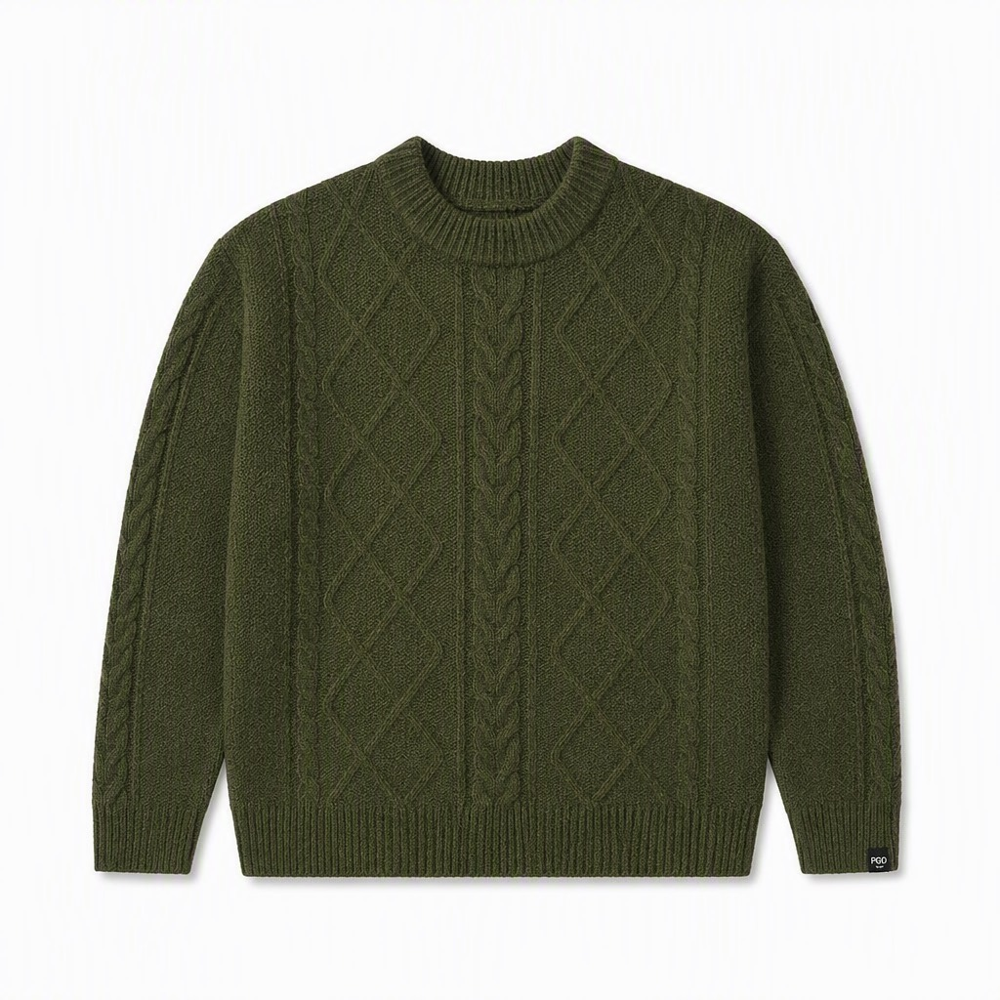<br><sub>output · 1024×1024 · 60 credits</sub></td>
</tr></table>

Random creases pressed out, shoulders squared, both sleeves aligned in length and angle, hem ribbing flattened, lighting evened with no hot spot; stitch pattern, colour, ribbing and cuff label survive and come out sharper, on a pure white ground with a soft contact shadow.

<details>
<summary>Reproducible command</summary>

```bash
dlazy gpt-image-2 \
  --prompt 'Studio retouch of a flat-lay garment photo. Clean up this olive-green cable-knit sweater to catalog standard: press out the random wrinkles and creases in the body and sleeves, straighten and symmetrise the silhouette, square the shoulders, align both sleeves evenly, tidy the collar and hem, and even out the lighting so there is no hot spot or colour cast. Keep the cable-knit and diamond stitch pattern, the exact olive-green colour, the ribbed collar/cuffs/hem and the woven cuff label unchanged and sharper than before. Pure white seamless background with a subtle soft contact shadow. Photorealistic, print-ready, no text, no watermark.' \
  --images docs/item-repair/source-flatlay.jpg \
  --size 1024x1024 --quality high --imageFormat jpeg \
  --save docs/item-repair/example-output.jpg
```

</details>---

## Quick start

Skills install with [`npx skills`](https://github.com/vercel-labs/skills). It scans this
repo's `skills/` directory and installs into the skill directory of Claude Code, Codex,
Cursor and other agents.

```bash
npx skills add https://github.com/dlazy-ai/ecommerce-skills --all       # all 26 at once
npx skills add https://github.com/dlazy-ai/ecommerce-skills --list      # see what is in here
```

`--all` is shorthand for `--skill '*' --agent '*' -y`. To narrow it down, use
`--agent claude-code` to pick one agent, or `--skill flat-lay --skill detect-task`
(skill names are the first column of the index below) to install only what you need.
The default target is the current project, `.claude/skills/<name>/`; add `-g` to install
at user level and share across projects. Later, `npx skills update` / `remove`.

You can also skip installing entirely: paste any `skill.md` into a chat and the agent
follows it — every skill keeps a script-free manual path.

### Three ways to use it

One asset set, three consumption surfaces:

```bash
# 1. As agent skills (Claude Code / Cursor / Codex)
npx skills add https://github.com/dlazy-ai/ecommerce-skills --all

# 2. As a command-line pipeline
node shared/scripts/batch.mjs --input skus.csv --task flat-lay \
  --template prompt.txt --outdir out/ --concurrency 4 --max-credits 3000

# 3. As an MCP server (any MCP client)
node mcp/server.mjs
```

MCP config: `{ "mcpServers": { "ecommerce": { "command": "node", "args": ["/abs/path/to/ecommerce-skills/mcp/server.mjs"] } } }`

### Dependencies

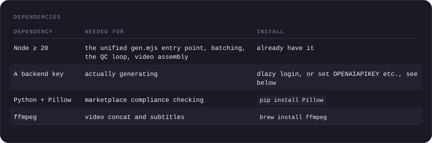

<details>
<summary>Dependencies as a table</summary>

| Dependency | Needed for | Install |
| --- | --- | --- |
| Node ≥ 20 | the unified `gen.mjs` entry point, batching, the QC loop, video assembly | already have it |
| A backend key | actually generating | `dlazy login`, or set `OPENAI_API_KEY` etc., see below |
| Python + Pillow | marketplace compliance checking | `pip install Pillow` |
| ffmpeg | video concat and subtitles | `brew install ffmpeg` |

</details>

Without any of them you can still run `--dry-run` end to end and see exactly what would
be sent and what it would cost.

### Backends

```bash
node shared/scripts/gen.mjs --doctor      # which backend is usable right now
```

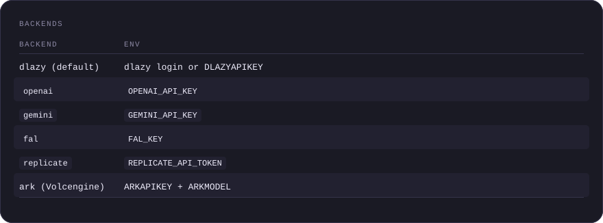

<details>
<summary>Backends as a table</summary>

| Backend | Env |
| --- | --- |
| `dlazy` (default) | `dlazy login` or `DLAZY_API_KEY` |
| `openai` | `OPENAI_API_KEY` |
| `gemini` | `GEMINI_API_KEY` |
| `fal` | `FAL_KEY` |
| `replicate` | `REPLICATE_API_TOKEN` |
| `ark` (Volcengine) | `ARK_API_KEY` + `ARK_MODEL` |

</details>

Resolution order: `--provider` flag > `PROVIDER` env > first backend with credentials > `dlazy`.
Model IDs per backend can be overridden with `GEN_MODEL_<PROVIDER>` — vendor catalogs
change, so check their current docs.

---

## Skills

### On-model — put the product on a person

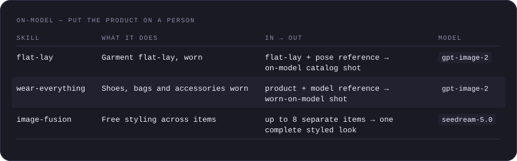

<details>
<summary>On-model — put the product on a person (as a table)</summary>

| Skill | What it does | In → out | Model |
| --- | --- | --- | --- |
| [flat-lay](skills/flat-lay/skill.md) | Garment flat-lay, worn | flat-lay + pose reference → on-model catalog shot | `gpt-image-2` |
| [wear-everything](skills/wear-everything/skill.md) | Shoes, bags and accessories worn | product + model reference → worn-on-model shot | `gpt-image-2` |
| [image-fusion](skills/image-fusion/skill.md) | Free styling across items | up to 8 separate items → one complete styled look | `seedream-5.0` |

</details>

### One image into many

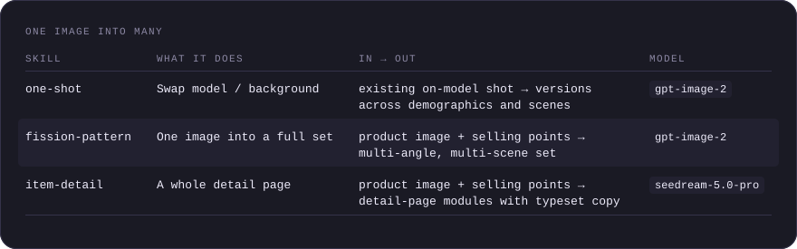

<details>
<summary>One image into many (as a table)</summary>

| Skill | What it does | In → out | Model |
| --- | --- | --- | --- |
| [one-shot](skills/one-shot/skill.md) | Swap model / background | existing on-model shot → versions across demographics and scenes | `gpt-image-2` |
| [fission-pattern](skills/fission-pattern/skill.md) | One image into a full set | product image + selling points → multi-angle, multi-scene set | `gpt-image-2` |
| [item-detail](skills/item-detail/skill.md) | A whole detail page | product image + selling points → detail-page modules with typeset copy | `seedream-5.0-pro` |

</details>

### From scratch

| Skill | What it does | In → out | Model |
| --- | --- | --- | --- |
| [creative-scene](skills/creative-scene/skill.md) | Creative generation, plus pose / styling retargeting | one sentence (optional reference) → image | `banana-pro` |

### Video — the other half of the asset set

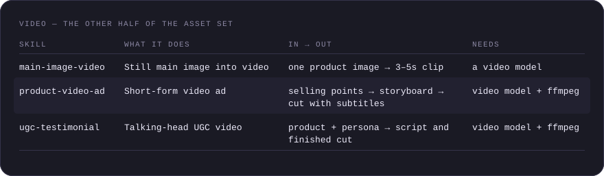

<details>
<summary>Video — the other half of the asset set (as a table)</summary>

| Skill | What it does | In → out | Needs |
| --- | --- | --- | --- |
| [main-image-video](skills/main-image-video/skill.md) | Still main image into video | one product image → 3–5s clip | a video model |
| [product-video-ad](skills/product-video-ad/skill.md) | Short-form video ad | selling points → storyboard → cut with subtitles | video model + ffmpeg |
| [ugc-testimonial](skills/ugc-testimonial/skill.md) | Talking-head UGC video | product + persona → script and finished cut | video model + ffmpeg |

</details>

### Scale and quality control

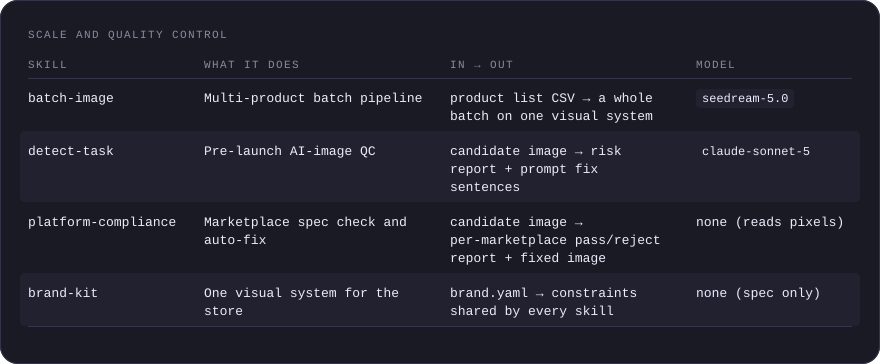

<details>
<summary>Scale and quality control (as a table)</summary>

| Skill | What it does | In → out | Model |
| --- | --- | --- | --- |
| [batch-image](skills/batch-image/skill.md) | Multi-product batch pipeline | product list CSV → a whole batch on one visual system | `seedream-5.0` |
| [detect-task](skills/detect-task/skill.md) | Pre-launch AI-image QC | candidate image → risk report + prompt fix sentences | `claude-sonnet-5` |
| [platform-compliance](skills/platform-compliance/skill.md) | Marketplace spec check and auto-fix | candidate image → per-marketplace pass/reject report + fixed image | none (reads pixels) |
| [brand-kit](skills/brand-kit/skill.md) | One visual system for the store | brand.yaml → constraints shared by every skill | none (spec only) |

</details>

### Listing and performance

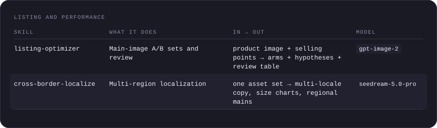

<details>
<summary>Listing and performance (as a table)</summary>

| Skill | What it does | In → out | Model |
| --- | --- | --- | --- |
| [listing-optimizer](skills/listing-optimizer/skill.md) | Main-image A/B sets and review | product image + selling points → arms + hypotheses + review table | `gpt-image-2` |
| [cross-border-localize](skills/cross-border-localize/skill.md) | Multi-region localization | one asset set → multi-locale copy, size charts, regional mains | `seedream-5.0-pro` |

</details>

### Single-purpose edits

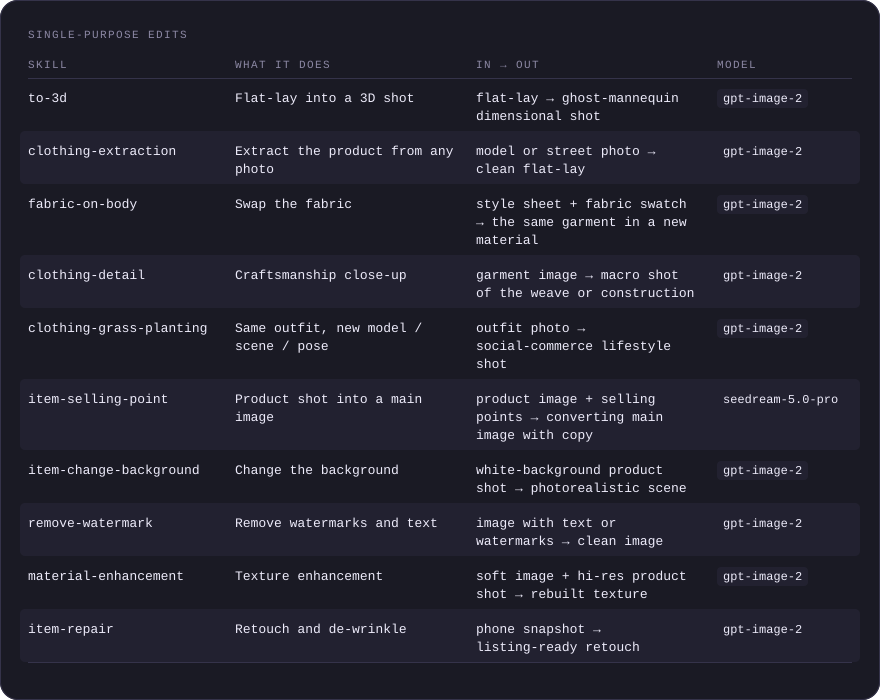

<details>
<summary>Single-purpose edits (as a table)</summary>

| Skill | What it does | In → out | Model |
| --- | --- | --- | --- |
| [to-3d](skills/to-3d/skill.md) | Flat-lay into a 3D shot | flat-lay → ghost-mannequin dimensional shot | `gpt-image-2` |
| [clothing-extraction](skills/clothing-extraction/skill.md) | Extract the product from any photo | model or street photo → clean flat-lay | `gpt-image-2` |
| [fabric-on-body](skills/fabric-on-body/skill.md) | Swap the fabric | style sheet + fabric swatch → the same garment in a new material | `gpt-image-2` |
| [clothing-detail](skills/clothing-detail/skill.md) | Craftsmanship close-up | garment image → macro shot of the weave or construction | `gpt-image-2` |
| [clothing-grass-planting](skills/clothing-grass-planting/skill.md) | Same outfit, new model / scene / pose | outfit photo → social-commerce lifestyle shot | `gpt-image-2` |
| [item-selling-point](skills/item-selling-point/skill.md) | Product shot into a main image | product image + selling points → converting main image with copy | `seedream-5.0-pro` |
| [item-change-background](skills/item-change-background/skill.md) | Change the background | white-background product shot → photorealistic scene | `gpt-image-2` |
| [remove-watermark](skills/remove-watermark/skill.md) | Remove watermarks and text | image with text or watermarks → clean image | `gpt-image-2` |
| [material-enhancement](skills/material-enhancement/skill.md) | Texture enhancement | soft image + hi-res product shot → rebuilt texture | `gpt-image-2` |
| [item-repair](skills/item-repair/skill.md) | Retouch and de-wrinkle | phone snapshot → listing-ready retouch | `gpt-image-2` |

</details>

Skills chain together, the output of one feeding the next. New listings, full-store
refreshes, cross-border rollouts and more —
**[8 pipelines → docs/pipelines.en.md](docs/pipelines.en.md)**.

---

## What the scripts do

Skill bodies describe *what to generate*. Everything else is code. All support `--dry-run`.

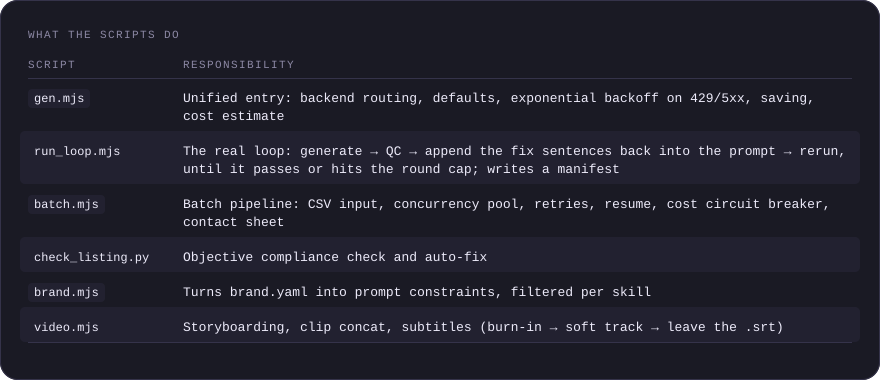

<details>
<summary>What the scripts do as a table</summary>

| Script | Responsibility |
| --- | --- |
| `gen.mjs` | Unified entry: backend routing, defaults, exponential backoff on 429/5xx, saving, cost estimate |
| `run_loop.mjs` | **The real loop**: generate → QC → append the fix sentences back into the prompt → rerun, until it passes or hits the round cap; writes a manifest |
| `batch.mjs` | Batch pipeline: CSV input, concurrency pool, retries, resume, cost circuit breaker, contact sheet |
| `check_listing.py` | Objective compliance check and auto-fix (background purity, subject occupancy, resolution, ratio, alpha, file size) |
| `brand.mjs` | Turns `brand.yaml` into prompt constraints, filtered per skill |
| `video.mjs` | Storyboarding, clip concat, subtitles (burn-in → soft track → leave the .srt) |

</details>

The loop in one command:

```bash
node shared/scripts/run_loop.mjs --task flat-lay \
  --prompt-file prompt.txt --images garment.jpg pose.jpg \
  --save out/sku001.jpg --platform amazon --max-rounds 3
```

Each generation is run through the Amazon machine check and AI QC. If it fails, the fix
sentences go back into the prompt and it reruns. Every round's prompt, risk level,
compliance verdict and cost land in `out/sku001.manifest.json`.

### What the compliance check catches

Try it on this repo's own example image — the verdict takes a second:

```bash
python3 shared/scripts/check_listing.py docs/flat-lay/example-output.jpg --platform amazon
```

```
docs/flat-lay/example-output.jpg  ·  Amazon main image  ·  rejection risk
  ✗ pure white background   only 0.0% of the border is pure white; base is about RGB(208, 208, 208)
  ! resolution              longest side 1536px — passes, but below the zoom threshold
```

That image looks like a clean light-grey studio backdrop to the eye. Amazon requires
**exactly RGB(255,255,255)**, so 208 grey gets rejected. `--fix out/` handles it in one
step: flatten to white → rebuild the canvas to hit the 85% occupancy rule → upscale to 1600px.

Supported: `amazon`, `tiktok-shop`, `temu`, `shopee`, `shopify`, `taobao`.

---

## Compute cost

Every skill supports `--dry-run`: it prints the parameters and the cost estimate without
generating anything. Measured per-image estimates (credits):

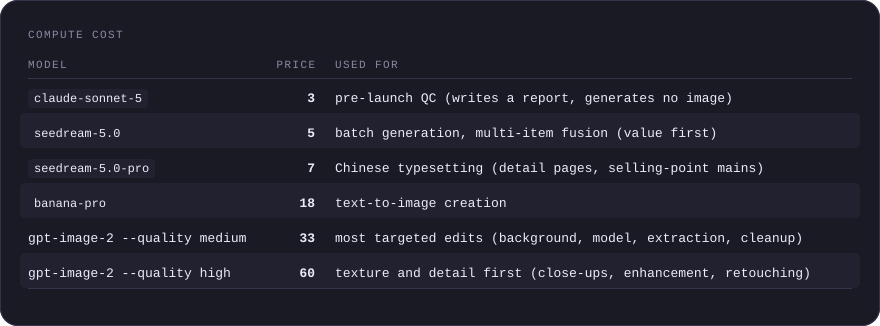

<details>
<summary>Compute cost as a table</summary>

| Model | Price | Used for |
| --- | --- | --- |
| `claude-sonnet-5` | **3** | pre-launch QC (writes a report, generates no image) |
| `seedream-5.0` | **5** | batch generation, multi-item fusion (value first) |
| `seedream-5.0-pro` | **7** | Chinese typesetting (detail pages, selling-point mains) |
| `banana-pro` | **18** | text-to-image creation |
| `gpt-image-2` `--quality medium` | **33** | most targeted edits (background, model, extraction, cleanup) |
| `gpt-image-2` `--quality high` | **60** | texture and detail first (close-ups, enhancement, retouching) |

</details>

Three ways to spend less: **`--dry-run` first**, to confirm unit price × count;
**explore cheap** (`banana-pro --imageSize 1K --batch 4` to find the direction, then
render 2K once it is settled); **keep `--batch 1` in batch jobs** (`--batch N` multiplies
cost by N — volume should come from SKU count, not from batch).
Running out of balance returns `code: "insufficient_balance"`; top up and rerun as
described in each skill's error-handling section.

---

## Notes

- **Generated output needs human review.** Every output is model inference. Occluded and reconstructed regions are not guaranteed to match the physical product — verify print placement, hardware details and size information by hand before listing.
- **What these skills will not do** is written into each skill's capability-boundary section: no inventing features the product does not have, no fake promotions, no fabricated celebrity endorsement, no hiding product defects.
- **Compliance**: skills that write copy ([item-detail](skills/item-detail/skill.md), [item-selling-point](skills/item-selling-point/skill.md)) need care around absolute claims and fake promotions. Run [detect-task](skills/detect-task/skill.md) and [platform-compliance](skills/platform-compliance/skill.md) before listing.
- **Marketplace rules change.** What `check_listing.py` ships is the machine-checkable subset; the marketplace's current official documentation wins. Pass your own JSON with `--rules` to change the criteria.
- **Labeling AI content**: [ugc-testimonial](skills/ugc-testimonial/skill.md) produces simulated endorsements — never present them as genuine buyer reviews, and check whether your target platform requires AI-generated content to be disclosed.
- **Video model IDs are not hardcoded.** They differ by backend and change often, and hardcoding them would only mislead — so you specify one explicitly via `DLAZY_VIDEO_MODEL`.

---

## Contributing and maintenance

External contributions: [CONTRIBUTING.md](CONTRIBUTING.md). Local builds, regression
checks and the ClawHub publishing flow for maintainers:
**[docs/maintainers.en.md](docs/maintainers.en.md)**.

The one rule easiest to trip over, up front: `shared/` is the single source of truth and
the scripts under `skills/<name>/` are generated copies, so **run `npm run build` after
editing anything shared** — otherwise the skill directories are not self-contained and
`npx skills add` installs something broken.

```bash
npm run build && npm test && npm run eval
```

## License

MIT — see [LICENSE](LICENSE).

## Polished with repolish

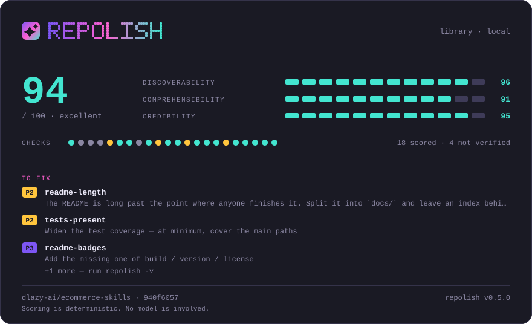

This card is generated by [repolish](https://github.com/asale-ai/repolish) and is an
ordinary file in the repository — no external fonts, no scripts, nothing hosted by a
third party. To score your own repo: `npx @asale/repolish`.
