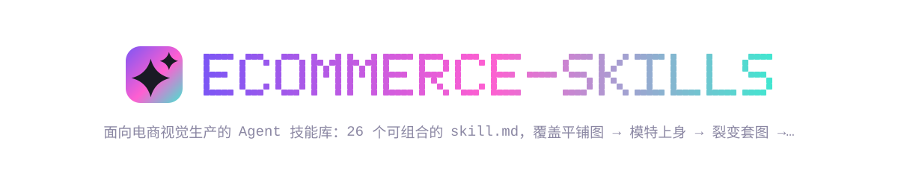

中文 · [English](README.en.md)

# ecommerce-skills

[](https://github.com/dlazy-ai/ecommerce-skills/actions/workflows/ci.yml)
[](LICENSE)
[](https://github.com/asale-ai/repolish)

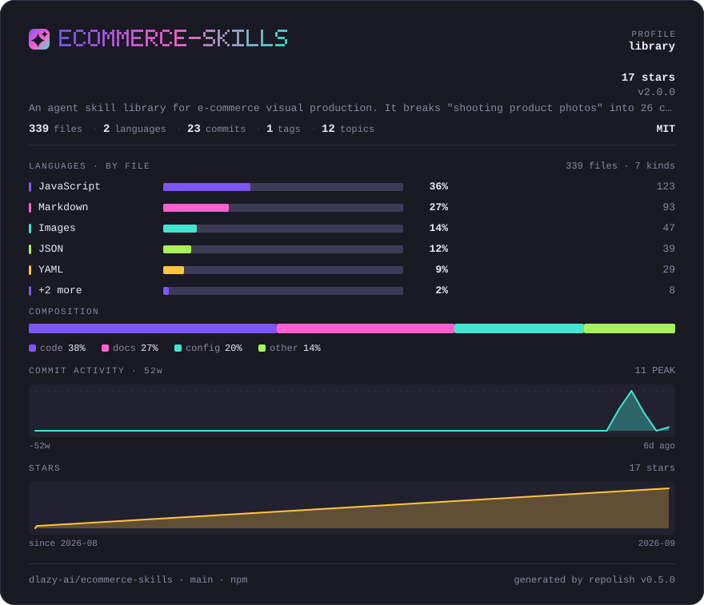


一套面向**电商视觉生产**的 Agent 技能库：把「拍商品图」这件事拆成 26 个可组合的技能，
每个技能是一份可直接执行的 `skill.md`，配套可执行脚本，底层可切换多家图像 / 视频 / 文本模型。

平铺图 → 模特上身图 → 裂变套图 → 详情页 → 主图视频 → 投前质检 → 平台合规校验，
整条链路不用摄影棚、不约模特。它和「一堆 prompt」的区别在于三件事：

- **不锁后端** —— dLazy 默认，也能用 OpenAI / Gemini / fal / Replicate / 火山方舟，自带 key 即可；没 key 也能 `--dry-run` 空跑看清要发什么。
- **确定性动作交给脚本** —— 批量、重试、断点续跑、成本熔断、合规校验、闭环重跑都是脚本，不靠模型每次现编。
- **能验收** —— 上架前的平台规格是机检的，不是「看着差不多」。

---

## 生成效果示例

下面每一组都是**真实执行的结果**：左边是输入素材，右边是实际生成的输出图——不是效果图。
每条命令原样照抄即可复现，折叠在图下面。单个技能的示例也内联在它自己的 `skills/<name>/skill.md` 开头。

### 商品上身 — 让商品出现在人身上

#### [flat-lay](skills/flat-lay/skill.md) — 服装图一键上身试穿

<table><tr>
<td align="center" valign="bottom"><br><sub>输入 · 服装平铺图 800×800</sub></td>
<td align="center" valign="bottom"><br><sub>输入 · 姿势参考图 768×1024</sub></td>
<td align="center" valign="bottom"><br><sub>输出 · 1024×1536 · 60 credits</sub></td>
</tr></table>

麻花织法、菱形提花、落肩版型、袖口罗纹与右袖织标均被保留；姿势、景别、光线与浅灰背景照抄参考图。

<details>
<summary>可复现命令</summary>

```bash
dlazy gpt-image-2 \
  --prompt 'E-commerce on-model product photography. Image 1 is the garment flat-lay: an olive-green cable-knit crewneck sweater. Image 2 is the pose/scene reference. Dress the model from image 2 in the garment from image 1, replacing the grey T-shirt. Keep the garment 100% faithful: identical olive-green color, cable-knit and diamond texture, oversized drop-shoulder fit, ribbed collar and cuffs, and the small woven label on the right cuff. Reproduce the reference exactly for pose, camera angle, crop, body proportions, lighting and the plain light-grey studio wall background. Photorealistic full-frame catalog shot, sharp fabric detail, natural soft light, no text or watermark.' \
  --images docs/flat-lay/garment-flatlay.jpg docs/flat-lay/pose-reference.jpg \
  --size 1024x1536 --quality high --imageFormat jpeg \
  --save docs/flat-lay/example-output.jpg
```

</details>

#### [wear-everything](skills/wear-everything/skill.md) — 鞋包配饰真人穿戴

<table><tr>
<td align="center" valign="bottom"><br><sub>输入 · 玳瑁色方框墨镜 768×1024</sub></td>
<td align="center" valign="bottom"><br><sub>输入 · 夜景街拍参考图 768×1024</sub></td>
<td align="center" valign="bottom"><br><sub>输出 · 1024×1536</sub></td>
</tr></table>

墨镜按正确的鼻梁/耳挂关系落位，镜框玳瑁纹理与镜片色保留；模特五官、围巾千鸟格、夜景街道与色调保持原样。

<details>
<summary>可复现命令</summary>

```bash
dlazy gpt-image-2 \
  --prompt 'On-model accessory product photography. Image 1 is the product: a pair of tortoise-brown rectangular sunglasses with dark grey lenses. Image 2 is the model/scene reference. Put the sunglasses from image 1 onto the face of the model in image 2, correctly seated on the nose bridge and ears with natural perspective, realistic lens reflections and a soft shadow on the cheekbones. Keep the product 100% faithful: identical frame shape, tortoise-brown acetate color and grain, hinge and temple design, lens tint. Change nothing else — face, hair, scarf, coat, bag chain, night street background, colour grading and crop must stay pixel-identical to image 2. Photorealistic, no text, no watermark.' \
  --images docs/wear-everything/product-sunglasses.jpg docs/wear-everything/model-reference.jpg \
  --size 1024x1536 --quality medium --imageFormat jpeg \
  --save docs/wear-everything/example-output.jpg
```

</details>

#### [image-fusion](skills/image-fusion/skill.md) — 多单品自由搭配融图

<table><tr>
<td align="center" valign="bottom"><br><sub>输入 1 · 麻花针织毛衣</sub></td>
<td align="center" valign="bottom"><br><sub>输入 2 · 编织渔夫帽</sub></td>
<td align="center" valign="bottom"><br><sub>输入 3 · 珍珠项链</sub></td>
<td align="center" valign="bottom"><br><sub>输出 · 3:4 / 2K · 5 credits</sub></td>
</tr></table>

三件单品同时到位，毛衣的麻花织法、渔夫帽的编织配色与项链的珠径都被保留；未提供的下装与鞋按 prompt 指定补齐。

<details>
<summary>可复现命令</summary>

```bash
dlazy seedream-5.0 \
  --prompt '电商搭配商拍图。将参考图中的多件单品组合到同一个模特身上：图1 的军绿色麻花针织圆领毛衣作为上装，图2 的彩色编织渔夫帽戴在头上，图3 的珍珠项链戴在颈部。每件单品必须与参考图完全一致——颜色、织法纹理、图案、材质与细节都不能改。下装自动补一条米白色阔腿长裤，脚穿白色运动鞋。青年亚洲女模特，正面站姿，全身入画，纯浅灰色摄影棚背景，柔和顶光，真实照片质感，无文字无水印。' \
  --images docs/image-fusion/item-sweater.jpg docs/image-fusion/item-hat.jpg docs/image-fusion/item-necklace.jpg \
  --size 3:4 --resolution 2k \
  --save docs/image-fusion/example-output.jpg
```

</details>

### 单图变多图 — 一张图裂变成一屏

#### [one-shot](skills/one-shot/skill.md) — 换模特 / 换背景

<table><tr>
<td align="center" valign="bottom"><br><sub>输入 · 原模特图 768×1024</sub></td>
<td align="center" valign="bottom"><br><sub>输出 · 1024×1536</sub></td>
</tr></table>

灰色落肩短袖的颜色、版型、胸前 logo 与下摆弧线保持不变；模特换成另一位男青年，棚拍灰墙换成树影斑驳的街景，姿势与景别沿用原图。

<details>
<summary>可复现命令</summary>

```bash
dlazy gpt-image-2 \
  --prompt 'Replace the model and the background of this e-commerce photo while keeping the garment untouched. Keep the grey oversized short-sleeve T-shirt exactly as it is: same slate-grey colour, same drop-shoulder cut, same white chest logo, same folds and hem. Replace the person with a different male model of similar build and age, and replace the plain studio wall with a sunlit outdoor city street with soft bokeh. Keep the same pose, camera angle, crop and framing. Photorealistic catalog shot, natural light, no text, no watermark.' \
  --images docs/one-shot/source-model.jpg \
  --size 1024x1536 --quality medium --imageFormat jpeg \
  --save docs/one-shot/example-output.jpg
```

</details>

#### [fission-pattern](skills/fission-pattern/skill.md) — 一张图裂变完整套图

<table><tr>
<td align="center" valign="bottom"><br><sub>输入 · 商品图</sub></td>
<td align="center" valign="bottom"><br><sub>输出 1 · 正面主图</sub></td>
<td align="center" valign="bottom"><br><sub>输出 2 · 场景使用图</sub></td>
<td align="center" valign="bottom"><br><sub>输出 3 · 细节微距图</sub></td>
</tr></table>

三张的商品保真段逐字相同，只有镜位段在变——蓝图纸冷调侧光 / 咖啡桌暖色窗光 / 表盘微距硬光勾边。下面是套图第 2 张的命令。

<details>
<summary>可复现命令（套图第 2 张）</summary>

```bash
dlazy gpt-image-2 \
  --prompt 'E-commerce product photography, set image 2 of 3 — in-use lifestyle shot. The subject is the watch from the reference image: a polished stainless-steel watch with a silver sunburst dial, applied baton markers and a black crocodile-embossed leather strap. Keep the product 100% faithful: same case shape and polish, same dial colour and marker layout, same hand shapes, same crown, same strap embossing and stitching — it must be recognisably the identical watch as the reference. Show it worn on a man wrist resting on a wooden cafe table beside a white coffee cup, dark suit sleeve and white shirt cuff visible, warm window light, shallow depth of field with a blurred cafe background. Photorealistic, no text, no watermark.' \
  --images docs/fission-pattern/product-watch.jpg \
  --size 1024x1536 --quality medium --imageFormat jpeg \
  --save docs/fission-pattern/example-output-2.jpg
```

</details>

#### [item-detail](skills/item-detail/skill.md) — 一键生成全套详情图

<table><tr>
<td align="center" valign="bottom"><br><sub>输入 · 商品平铺图 800×800</sub></td>
<td align="center" valign="bottom"><br><sub>输出 · 3:4 / 2K · 5 credits</sub></td>
</tr></table>

模特上身图占左侧，毛衣的军绿色、麻花与菱形提花保留；右上标题「粗棒麻花 复古落肩」与副标题字形正确、层级分明；底部三个线描图标配「亲肤不扎」「不易变形」「机洗不缩」，米灰底暖调，排版对齐。

<details>
<summary>可复现命令（首屏 banner 模块）</summary>

```bash
dlazy seedream-5.0-pro \
  --prompt '电商服饰详情页首屏 banner，竖版。左侧是图1 中的军绿色麻花针织圆领毛衣的模特上身图（青年男模特，半身，落肩宽松版型），毛衣颜色、麻花织法与菱形提花必须与图1一致。右上方留白区排版中文标题，大字「粗棒麻花 复古落肩」，副标题小字「羊毛混纺 · 加厚保暖 · 男女同款」。底部一行三个圆形图标配文字「亲肤不扎」「不易变形」「机洗不缩」。整体米灰色背景，暖色调，留白克制，字体为无衬线黑体，排版整齐对齐，商业电商详情页设计感，中文字必须清晰正确无乱码。' \
  --images docs/item-detail/product-flatlay.jpg --size 3:4 \
  --save docs/item-detail/example-output.jpg
```

</details>

### 图片创作 — 从零造图

#### [creative-scene](skills/creative-scene/skill.md) — 创意生图 + 改模特/姿势/搭配模板

<table><tr>
<td align="center" valign="bottom"><br><sub>输出 · 3:4 / 2K · 18 credits</sub></td>
</tr></table>

不需要输入素材，只有一句描述。人物、穿着、法式咖啡馆场景、三分之三正面半身景别与暖白影调全部按描述落位——五个槽位（人物 / 穿着 / 场景 / 视角景别 / 氛围影调）各管一段。这张图可以直接作为后续定向修改的输入。

<details>
<summary>可复现命令</summary>

```bash
dlazy banana-pro \
  --prompt 'A long-haired young Asian woman wearing a white puff-sleeve lace midi dress, sitting at a marble table inside a French-style cafe, fresh flowers and pastries arranged on the table, warm white colour grading, soft window light, front three-quarter view, waist-up framing, atmospheric editorial portrait, photorealistic, shot on 85mm, shallow depth of field, no text, no watermark.' \
  --aspectRatio 3:4 --imageSize 2K \
  --save docs/creative-scene/example-output.jpg
```

</details>

### 企业功能 — 规模化与质量把关

#### [batch-image](skills/batch-image/skill.md) — 多商品批量生图流水线

<table><tr>
<td align="center" valign="bottom"><br><sub>输入 · SKU001 毛衣</sub></td>
<td align="center" valign="bottom"><br><sub>输入 · SKU002 德比鞋</sub></td>
<td align="center" valign="bottom"><br><sub>输出 · 1:1 / 2K · 5 credits</sub></td>
<td align="center" valign="bottom"><br><sub>输出 · 1:1 / 2K · 5 credits</sub></td>
</tr></table>

两张的背景色、光位、视角与投影方向一致——因为规范段逐字相同；商品各自保真。100 个 SKU 就是这个循环跑 100 次，总价约 500 credits。

<details>
<summary>可复现命令</summary>

```bash
for sku in a-sweater b-shoes; do
  case $sku in
    a-sweater) DESC='军绿色麻花针织圆领毛衣，落肩宽松版型' ;;
    b-shoes)   DESC='黑色亮面皮革布洛克德比鞋，厚底系带' ;;
  esac
  dlazy seedream-5.0 \
    --prompt "电商商拍图。图1 是商品：${DESC}。商品的颜色、材质纹理、款式细节必须与图1完全一致。放置在同一套统一视觉里：纯米白色摄影棚背景，柔和顶光加左侧补光，45 度视角，画面下方留出统一的商品投影，构图与留白在整组图中保持一致。真实商业产品摄影，无文字无水印。" \
    --images docs/batch-image/sku-${sku}.jpg --size 1:1 --resolution 2k \
    --save docs/batch-image/example-output-${sku}.jpg
done
```

</details>

#### [detect-task](skills/detect-task/skill.md) — 投前检测（AI 图质检）

<table><tr>
<td align="center" valign="bottom"><br><sub>输入 · 待检图（flat-lay 的输出）</sub></td>
</tr></table>

输出是报告不是图，3 credits，[完整报告在这里](docs/detect-task/example-report.md)。摘要：

- **风险等级**：低风险
- **8 项判定**：7 项通过；`文字乱码` 命中（轻微）——左侧袖口的织标图案模糊不可辨
- **投放建议**：建议人工修图（仅需局部处理袖口小标签）
- **修正建议**：`clear and legible brand tag/logo embroidery on cuff, sharp fine detail, no blurry or garbled text`

这条修正句可以直接追加到 flat-lay 的原 prompt 末尾重跑——这就是闭环。

<details>
<summary>可复现命令</summary>

```bash
dlazy claude-sonnet-5 \
  --prompt '你是电商投放前的图片质检员。审查这张 AI 生成的服装商拍图能否直接用于电商投放。全部用中文作答（第 4 项的 prompt 修正句除外）。严格按以下结构输出：
## 1. 风险等级
低风险 / 中风险 / 高风险（三选一）
## 2. 风险项逐条判定
用表格输出，三列：风险项 / 结论（通过 或 命中）/ 证据。风险项固定为这 8 条：商品崩坏、人脸不自然、手部异常、肢体结构错误、文字乱码、光影矛盾、边缘融合痕迹、平台合规。
## 3. 投放建议
建议投放 / 建议重跑 / 建议人工修图
## 4. 修正建议
若建议重跑或人工修图，给出应追加到生成 prompt 的英文修正句 1-3 条；若建议投放，写「无需修正」。
只输出报告，不要寒暄。' \
  --images docs/detect-task/candidate.jpg \
  | python3 -c 'import sys,json;print(json.load(sys.stdin)["result"]["data"]["texts"][0])' \
  > docs/detect-task/example-report.md
```

</details>

### 自定义功能 — 单点能力

#### [to-3d](skills/to-3d/skill.md) — 平铺图转 3D 立体图

<table><tr>
<td align="center" valign="bottom"><br><sub>输入 · 平铺图 800×800</sub></td>
<td align="center" valign="bottom"><br><sub>输出 · 1024×1024</sub></td>
</tr></table>

肩胸被撑起、袖子自然弯曲、领口露出内里罗纹与背面内衬、下摆有自重投影；织法、军绿色、罗纹结构与右袖织标保持不变，画面里没有出现人台或人体。

<details>
<summary>可复现命令</summary>

```bash
dlazy gpt-image-2 \
  --prompt 'Turn this flat-lay garment photo into a dimensional 3D ghost-mannequin product shot. The olive-green cable-knit crewneck sweater must gain realistic volume: filled shoulders and chest, sleeves with natural bend, visible interior of the collar, soft self-shadow under the hem, as if worn by an invisible mannequin. Keep the garment 100% faithful: same olive-green colour, same cable-knit and diamond stitch pattern, same ribbed collar and cuffs, same woven cuff label. Clean seamless light-grey studio background, soft top light, sharp fibre detail. No mannequin, no person, no text.' \
  --images docs/to-3d/garment-flatlay.jpg \
  --size 1024x1024 --quality medium --imageFormat jpeg \
  --save docs/to-3d/example-output.jpg
```

</details>

#### [clothing-extraction](skills/clothing-extraction/skill.md) — 从任意图提取商品平铺图

<table><tr>
<td align="center" valign="bottom"><br><sub>输入 · 真人街拍图 480×640</sub></td>
<td align="center" valign="bottom"><br><sub>输出 · 1024×1024</sub></td>
</tr></table>

模特、项链、托特包、高跟鞋与喷泉背景全部清除，只留连衣裙；摊平居中、左右对称，立领罗纹、袖窿形状、腰线接缝与裙长按原图还原，浅灰针织纹理保留。

<details>
<summary>可复现命令</summary>

```bash
dlazy gpt-image-2 \
  --prompt 'Extract the garment worn by the model in this photo and render it as a clean e-commerce flat-lay. Output only the light-grey textured sleeveless knit mini dress with the mock neckline, laid flat and centred, front view, symmetric, fully unoccluded — remove the model, the pearl necklace, the tote bag, the shoes, the fountain and the whole background. Keep the garment 100% faithful: same light-grey colour, same knit texture, same neckline and armhole shape, same waist seam and hem length. Pure white seamless background, even soft studio light, subtle contact shadow. No person, no props, no text.' \
  --images docs/clothing-extraction/source-photo.jpg \
  --size 1024x1024 --quality medium --imageFormat jpeg \
  --save docs/clothing-extraction/example-output.jpg
```

</details>

#### [fabric-on-body](skills/fabric-on-body/skill.md) — 一键替换服装面料

<table><tr>
<td align="center" valign="bottom"><br><sub>输入 · 服装版式图 800×800</sub></td>
<td align="center" valign="bottom"><br><sub>输入 · 象牙白真丝缎面小样</sub></td>
<td align="center" valign="bottom"><br><sub>输出 · 1024×1024</sub></td>
</tr></table>

落肩剪裁、身长袖长、罗纹领口袖口下摆的结构与平铺角度都与版式图一致；材质从粗针织变成象牙白真丝缎面，褶皱上出现高光、垂坠变得柔顺。

<details>
<summary>可复现命令</summary>

```bash
dlazy gpt-image-2 \
  --prompt 'Fabric replacement for a garment style sheet. Image 1 is the garment pattern/style reference: an oversized drop-shoulder crewneck sweater with ribbed collar, cuffs and hem. Image 2 is the target fabric: ivory silk satin with a soft lustrous sheen and fine weave. Re-render the exact same garment silhouette from image 1 in the fabric from image 2. Keep the pattern identical: same oversized drop-shoulder cut, same body length, same sleeve length, same collar/cuff/hem construction, same flat-lay layout and camera angle. Replace only the material — the sweater must now read as ivory silk satin with specular highlights on the folds and soft drape instead of chunky knit. Clean white background, even studio light, no text.' \
  --images docs/fabric-on-body/style-sheet.jpg docs/fabric-on-body/fabric-swatch.jpg \
  --size 1024x1024 --quality medium --imageFormat jpeg \
  --save docs/fabric-on-body/example-output.jpg
```

</details>

#### [clothing-detail](skills/clothing-detail/skill.md) — 服装细节放大图

<table><tr>
<td align="center" valign="bottom"><br><sub>输入 · 服装平铺图 800×800</sub></td>
<td align="center" valign="bottom"><br><sub>输出 · 1024×1024 · 60 credits</sub></td>
</tr></table>

领口罗纹与麻花 panel 的交接、每根纱线的捻向、羊毛纤维的绒毛感都被解析出来，侧光让菱形提花的凹凸立体可见，远端落入柔和虚化。

<details>
<summary>可复现命令</summary>

```bash
dlazy gpt-image-2 \
  --prompt 'Macro detail shot for an e-commerce detail page. Zoom into the shoulder-and-collar area of this olive-green cable-knit sweater and render a photorealistic close-up that fills the frame. Show the ribbed crewneck collar meeting the raglan-style cable panel, individual yarn plies and the twist of the cable braid, the loft of the wool fibres, and soft directional light raking across the surface to reveal depth. Keep the colour and stitch pattern exactly as in the source. Shallow depth of field with the far edge softly out of focus, clean neutral background bokeh, no person, no text, no watermark.' \
  --images docs/clothing-detail/garment-flatlay.jpg \
  --size 1024x1024 --quality high --imageFormat jpeg \
  --save docs/clothing-detail/example-output.jpg
```

</details>

#### [clothing-grass-planting](skills/clothing-grass-planting/skill.md) — 相同穿搭改模特场景姿势

<table><tr>
<td align="center" valign="bottom"><br><sub>输入 · 原穿搭图</sub></td>
<td align="center" valign="bottom"><br><sub>输入 · 场景/模特参考图</sub></td>
<td align="center" valign="bottom"><br><sub>输出 · 1024×1536</sub></td>
</tr></table>

连衣裙的浅灰针织纹理、立领、腰线与裙长，珍珠项链的珠径，托特包的米白/棕拼色全部保留；模特、抚发姿势、咖啡馆街景、树影暖光与浅景深照抄参考图。

<details>
<summary>可复现命令</summary>

```bash
dlazy gpt-image-2 \
  --prompt 'Lifestyle social-commerce photo. Image 1 shows the outfit to keep: a light-grey textured sleeveless knit mini dress with a mock neckline, a pearl choker, a cream-and-tan tote bag and silver pointed heels. Image 2 is the model, pose, scene and lighting reference: a young woman on a sunlit tree-lined street outside a coffee shop, hand in her hair, warm dappled daylight, shallow depth of field. Put the complete outfit from image 1 onto the model from image 2. Keep every garment detail faithful: same grey knit texture, same neckline and hem length, same pearl choker, same tote bag colour blocking. Reproduce image 2 for the model identity, pose, camera angle, crop, street background and colour grading. Photorealistic influencer-style photo, no text, no watermark.' \
  --images docs/clothing-grass-planting/source-outfit.jpg docs/clothing-grass-planting/scene-reference.jpg \
  --size 1024x1536 --quality medium --imageFormat jpeg \
  --save docs/clothing-grass-planting/example-output.jpg
```

</details>

#### [item-selling-point](skills/item-selling-point/skill.md) — 商品图生成电商主图

<table><tr>
<td align="center" valign="bottom"><br><sub>输入 · 商品图 800×800</sub></td>
<td align="center" valign="bottom"><br><sub>输出 · 1:1 / 2048×2048 · 5 credits</sub></td>
</tr></table>

鞋的鳄鱼纹压花、雕花孔、鞋带与厚齿底保持一致，去底后居中偏左带柔和投影；右侧主标题「真皮软底 通勤久站不累」与两行小字卖点字形正确、层级分明；左上红色圆形角标「满300减30」。

<details>
<summary>可复现命令</summary>

```bash
dlazy seedream-5.0-pro \
  --prompt '电商正方形主图。主体是图1 中的黑色亮面皮革布洛克德比鞋，鞋型、雕花孔、鞋带与厚底必须与图1完全一致，商品去底后放在画面中央偏左，下方带柔和投影。背景为深灰到浅灰渐变，右侧竖排中文卖点文案：主标题大字「真皮软底 通勤久站不累」，下方两行小字卖点「牛皮鞋面 · 防滑厚底」「三防涂层 · 雨天不怕」。左上角一枚红色圆形促销角标写「满300减30」。无衬线黑体，字号层级分明，排版整齐，中文字清晰正确无乱码，商业电商主图设计。' \
  --images docs/item-selling-point/product-shoes.jpg --size 1:1 \
  --save docs/item-selling-point/example-output.jpg
```

</details>

#### [item-change-background](skills/item-change-background/skill.md) — 商品换背景

<table><tr>
<td align="center" valign="bottom"><br><sub>输入 · 白底商品图 800×800</sub></td>
<td align="center" valign="bottom"><br><sub>输出 · 1024×1024</sub></td>
</tr></table>

鞋的鳄鱼纹压花、雕花孔、白色沿条明线与厚齿底保持不变；背景换成窗边旧木板 + 枫叶，午后侧光在鞋头形成高光，每只鞋下都有接地投影，木纹的暖色被亮面皮革轻微反射。

<details>
<summary>可复现命令</summary>

```bash
dlazy gpt-image-2 \
  --prompt 'Place this product into a photorealistic lifestyle scene. Keep the pair of black patent leather derby shoes 100% faithful: same glossy patent finish, same brogue perforation pattern, same lacing, same chunky lug sole, same proportions and camera angle. Replace the plain background with a warm autumn scene: a weathered wooden floor beside a window, a few dry maple leaves, soft late-afternoon side light casting a natural contact shadow under each shoe, blurred indoor background. The shoes must sit believably on the surface with correct perspective and grounded shadows. Photorealistic commercial product photography, no text, no watermark.' \
  --images docs/item-change-background/product-shoes.jpg \
  --size 1024x1024 --quality medium --imageFormat jpeg \
  --save docs/item-change-background/example-output.jpg
```

</details>

#### [remove-watermark](skills/remove-watermark/skill.md) — 去水印去文字

<table><tr>
<td align="center" valign="bottom"><br><sub>输入 · 带边框/文案/角标的促销图</sub></td>
<td align="center" valign="bottom"><br><sub>输出 · 1024×1024</sub></td>
</tr></table>

红金边框、标题、活动时间、价格气泡、满减券条与角标全部清除，墙面、床头、地板与四件套接续自然，无字形残影；卧室、床品配色、台灯与墙上装饰画保留。

> 注意：对比原图可以看到房间透视被轻微重构了——这是重建而非像素级修补的正常结果。要严格保留原始像素请用专业修图工具。

<details>
<summary>可复现命令</summary>

```bash
dlazy gpt-image-2 \
  --prompt 'Remove every piece of text, price tag, badge, ribbon and decorative promotional frame from this image, and reconstruct what was behind them. Delete the red-and-gold border frame, the large headline, the date line, the price bubble with the number, the coupon banner and the bottom-right colour label. Keep the photograph itself completely unchanged: same bedroom, same bed, same taupe and cream bedding set, same table lamp, same wall art, same perspective, same colour grading and same resolution. Inpaint the cleared areas so the room continues naturally — walls, headboard, floor and bedding must look seamless, with no ghosting, blur patches or leftover letter shapes. Clean product photo, absolutely no text.' \
  --images docs/remove-watermark/source-watermarked.jpg \
  --size 1024x1024 --quality medium --imageFormat jpeg \
  --save docs/remove-watermark/example-output.jpg
```

</details>

#### [material-enhancement](skills/material-enhancement/skill.md) — 材质质感增强

<table><tr>
<td align="center" valign="bottom"><br><sub>输入 · 待增强上身图 1024×1536</sub></td>
<td align="center" valign="bottom"><br><sub>输入 · 高清平铺图 800×800</sub></td>
<td align="center" valign="bottom"><br><sub>输出 · 1024×1536 · 60 credits</sub></td>
</tr></table>

麻花辫的立体起伏、菱形提花的凹凸、羊毛的绒毛感与褶皱处的暗部层次被重建；模特五官、发型、手部、姿势、棕色长裤、灰墙背景与整体色调保持不变，毛衣轮廓与军绿色未偏移。

<details>
<summary>可复现命令</summary>

```bash
dlazy gpt-image-2 \
  --prompt 'Texture enhancement pass. Image 1 is the on-model photo to improve. Image 2 is the high-resolution product photo that defines the true fabric. Rebuild the sweater surface in image 1 using the real texture from image 2: crisp cable-braid relief, visible knit loops and yarn twist, natural wool loft, correct fold shadows and a matte fibre sheen. Do not change anything else — the model face, hair, hands, pose, brown trousers, background, framing and colour grading must stay identical to image 1. The garment silhouette and colour must not shift; only the material fidelity and micro-detail improve. Photorealistic, sharp, no text, no watermark.' \
  --images docs/material-enhancement/source-image.jpg docs/material-enhancement/hires-product.jpg \
  --size 1024x1536 --quality high --imageFormat jpeg \
  --save docs/material-enhancement/example-output.jpg
```

</details>

#### [item-repair](skills/item-repair/skill.md) — 商品精修 / 去褶皱

<table><tr>
<td align="center" valign="bottom"><br><sub>输入 · 带褶皱的平铺图 800×800</sub></td>
<td align="center" valign="bottom"><br><sub>输出 · 1024×1024 · 60 credits</sub></td>
</tr></table>

随机褶皱被压平、肩线方正、两只袖子长度与角度对齐、下摆罗纹平整、光照均匀无高光斑；织法、军绿色、罗纹结构与右袖织标保留且比原图更清晰，背景提纯为白底带柔和接地投影。

<details>
<summary>可复现命令</summary>

```bash
dlazy gpt-image-2 \
  --prompt 'Studio retouch of a flat-lay garment photo. Clean up this olive-green cable-knit sweater to catalog standard: press out the random wrinkles and creases in the body and sleeves, straighten and symmetrise the silhouette, square the shoulders, align both sleeves evenly, tidy the collar and hem, and even out the lighting so there is no hot spot or colour cast. Keep the cable-knit and diamond stitch pattern, the exact olive-green colour, the ribbed collar/cuffs/hem and the woven cuff label unchanged and sharper than before. Pure white seamless background with a subtle soft contact shadow. Photorealistic, print-ready, no text, no watermark.' \
  --images docs/item-repair/source-flatlay.jpg \
  --size 1024x1024 --quality high --imageFormat jpeg \
  --save docs/item-repair/example-output.jpg
```

</details>

---

## 快速开始

技能用 [`npx skills`](https://github.com/vercel-labs/skills) 安装，它会扫描本仓库的 `skills/` 目录，把技能装进 Claude Code / Codex / Cursor 等 agent 的技能目录。

```bash
npx skills add https://github.com/dlazy-ai/ecommerce-skills --all       # 一次装全部 26 个
npx skills add https://github.com/dlazy-ai/ecommerce-skills --list      # 先看看有哪些
```

`--all` 等价于 `--skill '*' --agent '*' -y`。想收窄范围，用 `--agent claude-code` 指定 agent，
用 `--skill flat-lay --skill detect-task`（技能名就是下面索引表第一列）只装用得上的几个。
默认装到当前项目 `.claude/skills/<name>/`，加 `-g` 装到用户级、所有项目共用；后续 `npx skills update` / `remove`。

不想装也行：任何一份 `skill.md` 的内容直接贴进对话，Agent 照着执行即可——每份技能都保留了不依赖脚本的等价手动步骤。

### 三种用法

同一份资产，三个消费面：

```bash
# 1. 作为 Agent 技能（Claude Code / Cursor / Codex）
npx skills add https://github.com/dlazy-ai/ecommerce-skills --all

# 2. 作为命令行流水线
node shared/scripts/batch.mjs --input skus.csv --task flat-lay \
  --template prompt.txt --outdir out/ --concurrency 4 --max-credits 3000

# 3. 作为 MCP server（任意 MCP 客户端）
node mcp/server.mjs
```

MCP 配置：`{ "mcpServers": { "ecommerce": { "command": "node", "args": ["/abs/path/to/ecommerce-skills/mcp/server.mjs"] } } }`

### 依赖

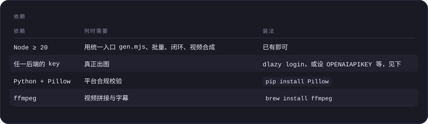

<details>
<summary>依赖（表格原文）</summary>

| 依赖 | 何时需要 | 装法 |
| --- | --- | --- |
| Node ≥ 20 | 用统一入口 `gen.mjs`、批量、闭环、视频合成 | 已有即可 |
| 任一后端的 key | 真正出图 | `dlazy login`，或设 `OPENAI_API_KEY` 等，见下 |
| Python + Pillow | 平台合规校验 | `pip install Pillow` |
| ffmpeg | 视频拼接与字幕 | `brew install ffmpeg` |

</details>

都没有也能跑通 `--dry-run`，看清每一步要发什么、花多少。

### 选后端

```bash
node shared/scripts/gen.mjs --doctor      # 看当前哪个后端可用
```

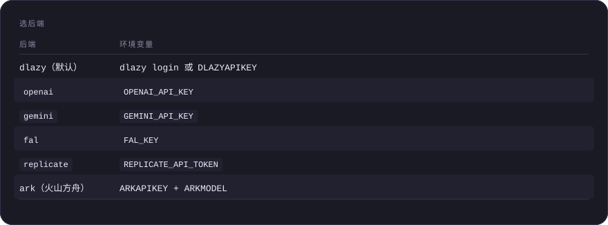

<details>
<summary>选后端（表格原文）</summary>

| 后端 | 环境变量 |
| --- | --- |
| `dlazy`（默认） | `dlazy login` 或 `DLAZY_API_KEY` |
| `openai` | `OPENAI_API_KEY` |
| `gemini` | `GEMINI_API_KEY` |
| `fal` | `FAL_KEY` |
| `replicate` | `REPLICATE_API_TOKEN` |
| `ark`（火山方舟） | `ARK_API_KEY` + `ARK_MODEL` |

</details>

优先级：`--provider` 参数 > `PROVIDER` 环境变量 > 第一个配了 key 的 > `dlazy`。

---

## 技能索引

### 商品上身 — 让商品出现在人身上

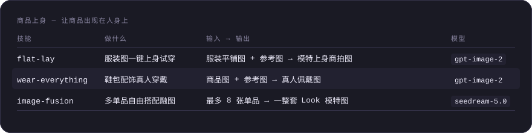

<details>
<summary>商品上身 — 让商品出现在人身上（表格原文）</summary>

| 技能 | 做什么 | 输入 → 输出 | 模型 |
| --- | --- | --- | --- |
| [flat-lay](skills/flat-lay/skill.md) | 服装图一键上身试穿 | 服装平铺图 + 参考图 → 模特上身商拍图 | `gpt-image-2` |
| [wear-everything](skills/wear-everything/skill.md) | 鞋包配饰真人穿戴 | 商品图 + 参考图 → 真人佩戴图 | `gpt-image-2` |
| [image-fusion](skills/image-fusion/skill.md) | 多单品自由搭配融图 | 最多 8 张单品 → 一整套 Look 模特图 | `seedream-5.0` |

</details>

### 单图变多图 — 一张图裂变成一屏

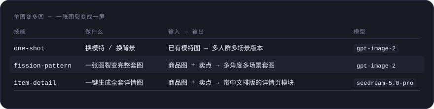

<details>
<summary>单图变多图 — 一张图裂变成一屏（表格原文）</summary>

| 技能 | 做什么 | 输入 → 输出 | 模型 |
| --- | --- | --- | --- |
| [one-shot](skills/one-shot/skill.md) | 换模特 / 换背景 | 已有模特图 → 多人群多场景版本 | `gpt-image-2` |
| [fission-pattern](skills/fission-pattern/skill.md) | 一张图裂变完整套图 | 商品图 + 卖点 → 多角度多场景套图 | `gpt-image-2` |
| [item-detail](skills/item-detail/skill.md) | 一键生成全套详情图 | 商品图 + 卖点 → 带中文排版的详情页模块 | `seedream-5.0-pro` |

</details>

### 图片创作 — 从零造图

| 技能 | 做什么 | 输入 → 输出 | 模型 |
| --- | --- | --- | --- |
| [creative-scene](skills/creative-scene/skill.md) | 创意生图 + 改模特/姿势/搭配模板 | 一句描述（可选参考图）→ 图 | `banana-pro` |

### 视频 — 静态素材之外的另一半

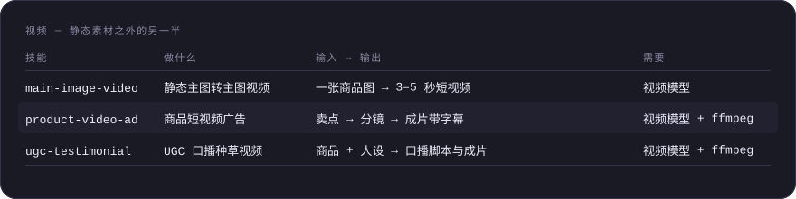

<details>
<summary>视频 — 静态素材之外的另一半（表格原文）</summary>

| 技能 | 做什么 | 输入 → 输出 | 需要 |
| --- | --- | --- | --- |
| [main-image-video](skills/main-image-video/skill.md) | 静态主图转主图视频 | 一张商品图 → 3–5 秒短视频 | 视频模型 |
| [product-video-ad](skills/product-video-ad/skill.md) | 商品短视频广告 | 卖点 → 分镜 → 成片带字幕 | 视频模型 + ffmpeg |
| [ugc-testimonial](skills/ugc-testimonial/skill.md) | UGC 口播种草视频 | 商品 + 人设 → 口播脚本与成片 | 视频模型 + ffmpeg |

</details>

### 企业功能 — 规模化与质量把关

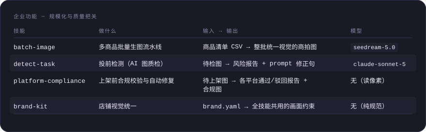

<details>
<summary>企业功能 — 规模化与质量把关（表格原文）</summary>

| 技能 | 做什么 | 输入 → 输出 | 模型 |
| --- | --- | --- | --- |
| [batch-image](skills/batch-image/skill.md) | 多商品批量生图流水线 | 商品清单 CSV → 整批统一视觉的商拍图 | `seedream-5.0` |
| [detect-task](skills/detect-task/skill.md) | 投前检测（AI 图质检） | 待检图 → 风险报告 + prompt 修正句 | `claude-sonnet-5` |
| [platform-compliance](skills/platform-compliance/skill.md) | 上架前合规校验与自动修复 | 待上架图 → 各平台通过/驳回报告 + 合规图 | 无（读像素） |
| [brand-kit](skills/brand-kit/skill.md) | 店铺视觉统一 | brand.yaml → 全技能共用的画面约束 | 无（纯规范） |

</details>

### 上架与投放 — 交付指标而不只是图

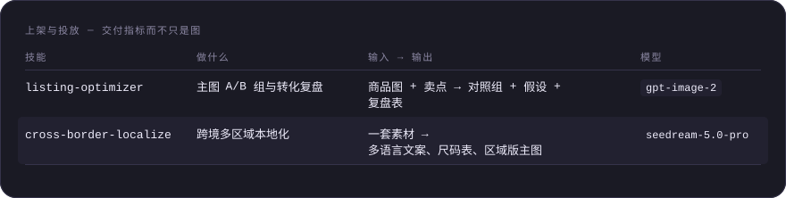

<details>
<summary>上架与投放 — 交付指标而不只是图（表格原文）</summary>

| 技能 | 做什么 | 输入 → 输出 | 模型 |
| --- | --- | --- | --- |
| [listing-optimizer](skills/listing-optimizer/skill.md) | 主图 A/B 组与转化复盘 | 商品图 + 卖点 → 对照组 + 假设 + 复盘表 | `gpt-image-2` |
| [cross-border-localize](skills/cross-border-localize/skill.md) | 跨境多区域本地化 | 一套素材 → 多语言文案、尺码表、区域版主图 | `seedream-5.0-pro` |

</details>

### 自定义功能 — 单点能力

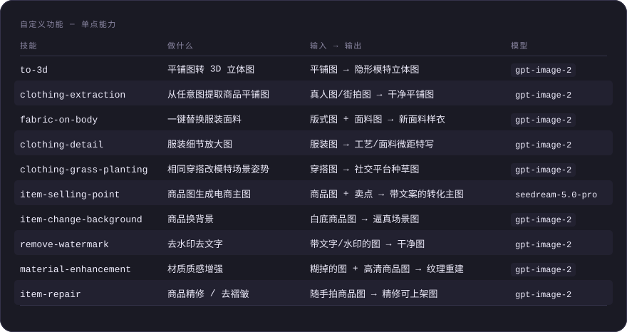

<details>
<summary>自定义功能 — 单点能力（表格原文）</summary>

| 技能 | 做什么 | 输入 → 输出 | 模型 |
| --- | --- | --- | --- |
| [to-3d](skills/to-3d/skill.md) | 平铺图转 3D 立体图 | 平铺图 → 隐形模特立体图 | `gpt-image-2` |
| [clothing-extraction](skills/clothing-extraction/skill.md) | 从任意图提取商品平铺图 | 真人图/街拍图 → 干净平铺图 | `gpt-image-2` |
| [fabric-on-body](skills/fabric-on-body/skill.md) | 一键替换服装面料 | 版式图 + 面料图 → 新面料样衣 | `gpt-image-2` |
| [clothing-detail](skills/clothing-detail/skill.md) | 服装细节放大图 | 服装图 → 工艺/面料微距特写 | `gpt-image-2` |
| [clothing-grass-planting](skills/clothing-grass-planting/skill.md) | 相同穿搭改模特场景姿势 | 穿搭图 → 社交平台种草图 | `gpt-image-2` |
| [item-selling-point](skills/item-selling-point/skill.md) | 商品图生成电商主图 | 商品图 + 卖点 → 带文案的转化主图 | `seedream-5.0-pro` |
| [item-change-background](skills/item-change-background/skill.md) | 商品换背景 | 白底商品图 → 逼真场景图 | `gpt-image-2` |
| [remove-watermark](skills/remove-watermark/skill.md) | 去水印去文字 | 带文字/水印的图 → 干净图 | `gpt-image-2` |
| [material-enhancement](skills/material-enhancement/skill.md) | 材质质感增强 | 糊掉的图 + 高清商品图 → 纹理重建 | `gpt-image-2` |
| [item-repair](skills/item-repair/skill.md) | 商品精修 / 去褶皱 | 随手拍商品图 → 精修可上架图 | `gpt-image-2` |

</details>

技能之间可以串起来用，输出直接作为下一步的输入。新款上架、整店改版、跨境铺货等
**[8 条典型链路 → docs/pipelines.md](docs/pipelines.md)**。

---

## 工程化：脚本干了什么

技能正文只写「要生成什么」，其余交给脚本。全部支持 `--dry-run`。

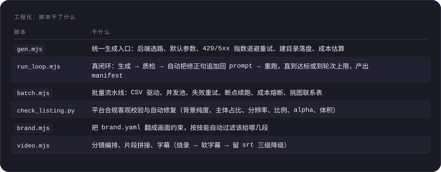

<details>
<summary>工程化：脚本干了什么（表格原文）</summary>

| 脚本 | 干什么 |
| --- | --- |
| `gen.mjs` | 统一生成入口：后端选路、默认参数、429/5xx 指数退避重试、建目录落盘、成本估算 |
| `run_loop.mjs` | **真闭环**：生成 → 质检 → 自动把修正句追加回 prompt → 重跑，直到达标或到轮次上限，产出 manifest |
| `batch.mjs` | 批量流水线：CSV 驱动、并发池、失败重试、断点续跑、成本熔断、挑图联系表 |
| `check_listing.py` | 平台合规客观校验与自动修复（背景纯度、主体占比、分辨率、比例、alpha、体积） |
| `brand.mjs` | 把 brand.yaml 翻成画面约束，按技能自动过滤该给哪几段 |
| `video.mjs` | 分镜编排、片段拼接、字幕（烧录 → 软字幕 → 留 srt 三级降级） |

</details>

一条命令看懂闭环：

```bash
node shared/scripts/run_loop.mjs --task flat-lay \
  --prompt-file prompt.txt --images garment.jpg pose.jpg \
  --save out/sku001.jpg --platform amazon --max-rounds 3
```

生成完自动过一遍 Amazon 机检和 AI 质检，不达标就把修正句接回 prompt 重跑，
每一轮的 prompt、风险等级、合规结论、成本都记进 `out/sku001.manifest.json`。

### 合规校验能抓到什么

拿本仓库自己的示例图试，一秒出结论：

```bash
python3 shared/scripts/check_listing.py docs/flat-lay/example-output.jpg --platform amazon
```

```
docs/flat-lay/example-output.jpg  ·  Amazon 主图  ·  有驳回风险
  ✗ 纯白背景   边缘仅 0.0% 为纯白，背景基色约 RGB(208, 208, 208)
  ! 分辨率     最长边 1536px，达标但不足以触发放大镜
```

这张图肉眼看是干净的浅灰棚拍背景，**但 Amazon 主图要求精确 RGB(255,255,255)**，
208 的灰会被驳回。加 `--fix out/` 一步修好：压白底 → 按 85% 目标重构画布 → 补到 1600px。

---

## 算力成本参考

每个技能都支持 `--dry-run`：只打印参数与算力估价、不真正生成。下表是各模型的实测估价（credits / 张）：

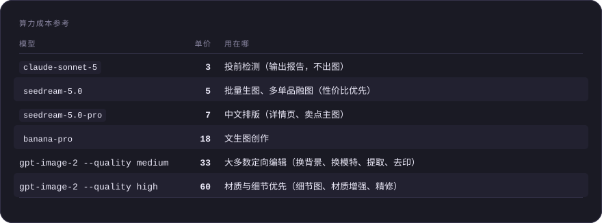

<details>
<summary>算力成本参考（表格原文）</summary>

| 模型 | 单价 | 用在哪 |
| --- | --- | --- |
| `claude-sonnet-5` | **3** | 投前检测（输出报告，不出图） |
| `seedream-5.0` | **5** | 批量生图、多单品融图（性价比优先） |
| `seedream-5.0-pro` | **7** | 中文排版（详情页、卖点主图） |
| `banana-pro` | **18** | 文生图创作 |
| `gpt-image-2` `--quality medium` | **33** | 大多数定向编辑（换背景、换模特、提取、去印） |
| `gpt-image-2` `--quality high` | **60** | 材质与细节优先（细节图、材质增强、精修） |

</details>

省钱的三条经验：**先 `--dry-run`** 确认单价 × 张数；**探索期用低档**（`banana-pro --imageSize 1K --batch 4` 看方向，定稿再出 2K）；
**批量场景 `--batch 1`**（`--batch N` 会让成本乘 N，批量靠 SKU 数量不靠 batch）。
余额不足会返回 `code: "insufficient_balance"`，按技能文档「错误处理」一节充值后重跑即可。

---

## 注意事项

- **生成结果需要人工鉴别**。所有输出都是模型推断，被遮挡区域、重建区域不保证与实物一致；关键部位（图案位置、五金细节、尺码信息）上架前必须人工核对。
- **不做的事**写在每个技能的「能力边界」里：不编造商品不具备的功能、不生成虚假促销、不伪造他人肖像代言、不抹除商品缺陷。
- **合规**：带文案的技能（[item-detail](skills/item-detail/skill.md)、[item-selling-point](skills/item-selling-point/skill.md)）注意绝对化用语与虚假促销；上架前建议过一遍 [detect-task](skills/detect-task/skill.md) 与 [platform-compliance](skills/platform-compliance/skill.md)。
- **平台规则会变**。`check_listing.py` 内置的是可机检子集，以各平台最新官方文档为准；需要改口径用 `--rules` 传自己的 JSON。
- **AI 生成内容的标注**：[ugc-testimonial](skills/ugc-testimonial/skill.md) 这类拟真内容不得声称是真实买家评价；部分平台强制标注 AI 生成，投放前确认目标平台规则。
- **视频模型不写死**。各家视频模型 ID 差异大更新快，写死只会误导，所以要你显式指定 `DLAZY_VIDEO_MODEL`。

---

## 参与与维护

外部贡献看 [CONTRIBUTING.md](CONTRIBUTING.md)。维护者的本地构建、回归与 ClawHub 发布流程见 **[docs/maintainers.md](docs/maintainers.md)**。

一条最容易踩的规则先放这儿：`shared/` 是单一真相源，`skills/<name>/` 下的脚本由构建脚本同步生成，
**改完共享文件一定要跑 `npm run build`**，否则技能目录不自包含、`npx skills add` 装出来是坏的。

```bash
npm run build && npm test && npm run eval
```

## License

见 [LICENSE](LICENSE)。

## 用 repolish 打磨

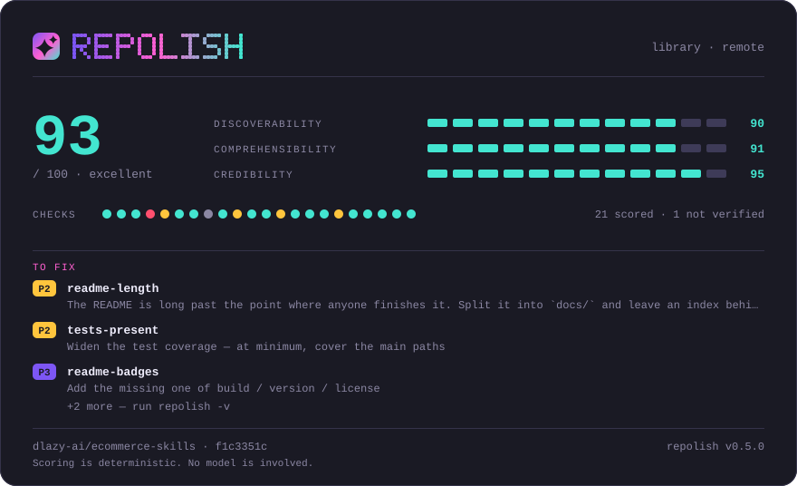

这张卡片由 [repolish](https://github.com/asale-ai/repolish) 生成，是仓库里的一个普通文件——没有外部字体、没有脚本、不由任何第三方托管。想给自己的仓库打一次分：`npx @asale/repolish`。
