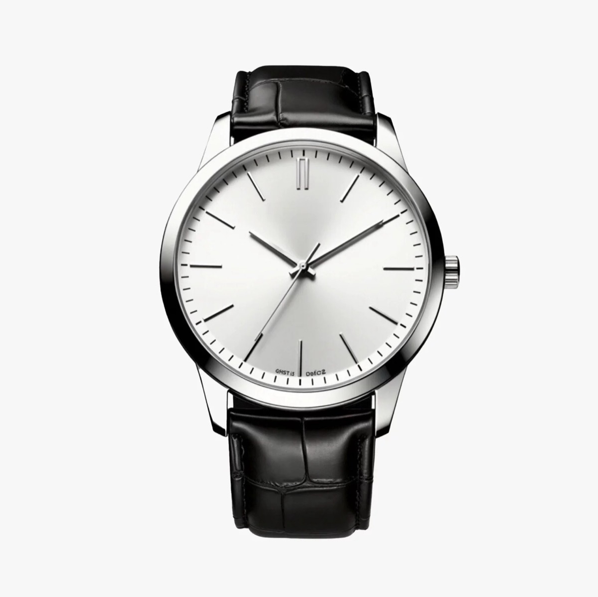
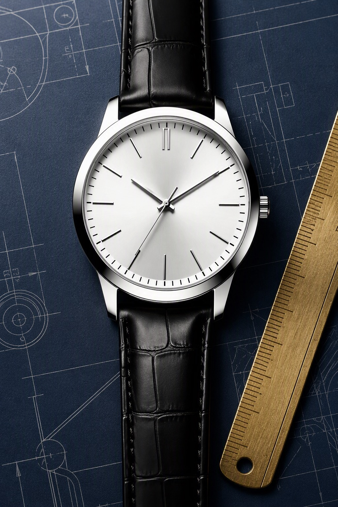
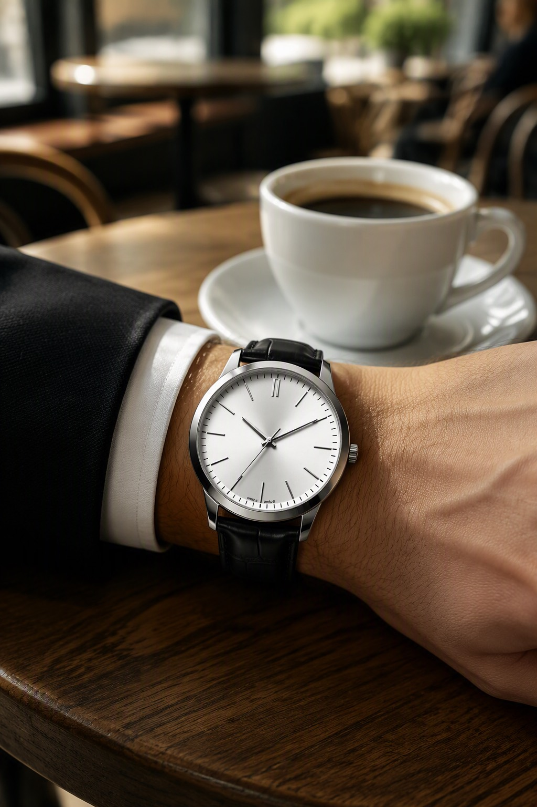
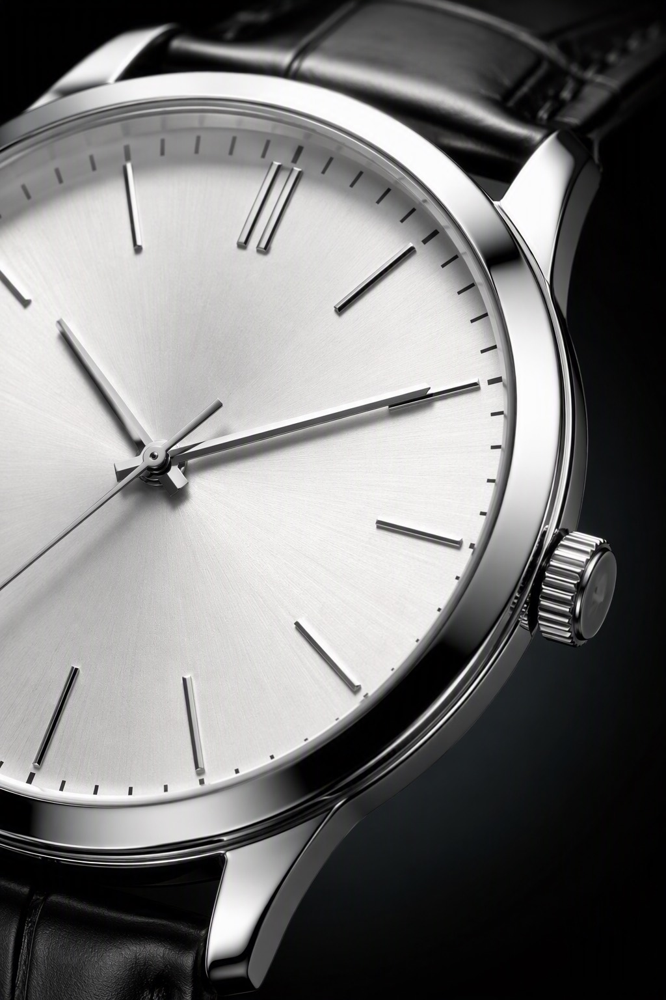

# fission-pattern — 一张图裂变完整套图

一张商品图 → **一整套**不同角度 / 场景 / 构图的商拍图。

电商主图位通常要 5 张，详情页要十几张。本技能解决的是「只有一张图，要凑满一屏」的问题：**同一件商品，多个机位与场景，视觉识别保持一致**。

---

## 生成效果示例

| 输入：商品图 |
| --- |
|  |
| `product-watch.jpg` — 黑色鳄鱼纹皮带钢壳银色太阳纹表盘手表 |

实际执行的命令（套图第 2 张，其余两张只换第三段镜位）：

```bash
dlazy gpt-image-2 \
  --prompt 'E-commerce product photography, set image 2 of 3 — in-use lifestyle shot. The subject is the watch from the reference image: a polished stainless-steel watch with a silver sunburst dial, applied baton markers and a black crocodile-embossed leather strap. Keep the product 100% faithful: same case shape and polish, same dial colour and marker layout, same hand shapes, same crown, same strap embossing and stitching — it must be recognisably the identical watch as the reference. Show it worn on a man wrist resting on a wooden cafe table beside a white coffee cup, dark suit sleeve and white shirt cuff visible, warm window light, shallow depth of field with a blurred cafe background. Photorealistic, no text, no watermark.' \
  --images docs/fission-pattern/product-watch.jpg \
  --size 1024x1536 --quality medium --imageFormat jpeg \
  --save docs/fission-pattern/example-output-2.jpg
```

**输出：一套三张**

| 1 · 正面主图 | 2 · 场景使用图 | 3 · 细节微距图 |
| --- | --- | --- |
|  |  |  |
| 蓝图纸 + 黄铜直尺，冷调侧光 | 手腕佩戴 + 咖啡桌，暖色窗光 | 表盘/刻度/表冠微距，硬光勾边 |

三张的商品保真段逐字相同，只有镜位段在变。

---

## 1、能力边界

| 模式 | 说明 |
| --- | --- |
| 商品套图 | 同一商品 → 正面主图 / 45 度图 / 场景使用图 / 细节微距图 / 尺寸对比图 |
| 姿势套图 | 同一模特同一穿搭 → 正面 / 侧面 / 背面 / 走动 / 坐姿 |

| 输入 | 说明 |
| --- | --- |
| 商品图 | 1 张，主视角最佳 |
| 商品名称 | 例：`撞色长款风衣` |
| 商品卖点 | 例：`100% 纯棉，轻盈舒适透气，法式复古撞色元素`（用于决定场景与氛围） |

**不做**：不改商品的外形、颜色、材质与结构；不编造商品没有的功能卖点；不生成虚假促销信息。

---

## 2、输入素材规则

生成前先自检这几条硬性约束：

- 大小：**20KB ~ 15MB**
- 分辨率：**大于 400×400**
- 格式：**jpg / jpeg / png / webp**

**输入建议**

| 做法 | 说明 |
| --- | --- |
| ✅ 主视角 + 纯净背景 | 越干净，整套图的商品一致性越高 |
| ✅ 卖点写具体 | `防水防汗` 会带出运动场景，`法式复古` 会带出咖啡馆场景 |
| ✅ 商品结构完整可见 | 套图里的细节图要靠这张图推断结构 |
| ❌ 已经带营销文字的图 | 文字会被复制到每张套图里，先用 [remove-watermark](../remove-watermark/skill.md) 洗干净 |
| ❌ 商品被手/道具遮挡 | 遮住的部分在每张套图里都会不一样 |

---

## 3、套图配方：5 张主图位怎么排

把「一套图」拆成固定的镜位清单，每张一条 prompt，**商品描述段完全复用，只换镜位段**：

| # | 镜位 | 作用 | 镜位段示例 |
| --- | --- | --- | --- |
| 1 | 正面主图 | 搜索列表首图，要最清楚 | `straight-on hero shot filling the frame, clean seamless background, even studio light` |
| 2 | 45 度立体图 | 交代体积与厚度 | `45-degree three-quarter angle showing depth and side profile, soft gradient background` |
| 3 | 场景使用图 | 建立使用联想 | `in-use lifestyle shot: [场景 + 人物动作], warm window light, shallow depth of field` |
| 4 | 细节微距图 | 证明材质与工艺 | `macro close-up of [关键工艺部位] filling the frame, hard rim light, extreme detail` |
| 5 | 对比 / 内构图 | 交代尺寸或内部 | `[尺寸对比物 / 内部结构] shown alongside the product, top-down layout, neutral background` |

**一致性的关键**：三段结构里，第一段（商品保真描述）在 5 条 prompt 里**逐字相同**，只有第三段（镜位）在变。

```text
[段1 商品保真：不变]  +  [段2 卖点氛围：不变]  +  [段3 镜位：每张不同]
```

---

## 4、卖点 → 场景的映射

卖点决定第 3 张场景图长什么样，别让模型自由发挥：

| 卖点类型 | 场景写法 |
| --- | --- |
| 保暖 / 加厚 | `snowy outdoor street, breath visible, cold blue ambient with warm rim light` |
| 透气 / 速干 | `gym or running track, dynamic mid-motion, bright daylight` |
| 防水 / 三防 | `rainy pavement with water droplets beading on the surface, overcast light` |
| 通勤 / 商务 | `office lobby or subway station, dark suit context, cool neutral light` |
| 法式 / 复古 | `French cafe interior, marble table, warm window light, film colour grading` |
| 亲肤 / 婴童 | `soft nursery bedding, pastel palette, very soft diffused light` |
| 精密 / 工艺 | `dark navy blueprint paper with a brass ruler, cool directional side light` |

**姿势套图**用的是另一组：正面站姿 / 侧身转头 / 背面回头 / 自然行走 / 坐姿——每条只换姿势段，模特与穿搭段逐字不变（写法可直接复用 [creative-scene](../creative-scene/skill.md) 的改姿势句式）。

---

## 5、dLazy 工具调用

本技能使用 dLazy 的 **`gpt-image-2`**（套图的核心指标是**整套图里的商品是同一件**，需要最强的参考图保真；实测低价模型在多场景切换时会漂移出另一款商品）。

### Authentication

All requests require a dLazy API key. The recommended way to authenticate is:

```bash
dlazy login
```

This runs a device-code flow (also works in remote shells) and **automatically saves your API key** to the local CLI config — no manual copy/paste required.

#### Alternative: Set the Key Manually

If you already have an API key, you can save it directly:

```bash
dlazy auth set YOUR_API_KEY
```

The CLI saves the key in your user config directory (`~/.dlazy/config.json` on macOS/Linux, `%USERPROFILE%\.dlazy\config.json` on Windows), with file permissions restricted to your OS user account. You can also supply the key per-invocation via the `DLAZY_API_KEY` environment variable.

#### Getting Your API Key Manually

1. Sign in or create an account at [dlazy.com](https://dlazy.com)
2. Go to [dlazy.com/dashboard/organization/api-key](https://dlazy.com/dashboard/organization/api-key)
3. Copy the key shown in the API Key section

Each key is scoped to your dLazy organization and can be **rotated or revoked at any time** from the same dashboard.

### About & Provenance

- **CLI source code**: [github.com/dlazyai/cli](https://github.com/dlazyai/cli)
- **Maintainer**: dlazyai
- **npm package**: `@dlazy/cli` (pinned to `1.2.3` in this skill's install spec)
- **Homepage**: [dlazy.com](https://dlazy.com)

You can install on demand without persisting a global binary by running:

```bash
npx @dlazy/cli@1.2.3 <command>
```

Or, if you prefer a global install, the skill's `metadata.clawdbot.install` field declares the exact pinned version (`npm install -g @dlazy/cli@1.2.3`). Review the GitHub source before installing.

### How It Works

This skill is a thin client over the dLazy hosted API. When you invoke it:

- Prompts and parameters you provide are sent to the dLazy API endpoint (`api.dlazy.com`) for inference.
- Any local file paths you pass to image / video / audio fields are uploaded to dLazy's media storage (`files.dlazy.com`) so the model can read them — the same flow as any cloud-based generation API.
- Generated output URLs returned by the API are hosted on `files.dlazy.com`.

This is the standard SaaS pattern; the skill itself does not access network or filesystem resources beyond what the dLazy CLI already handles. See [dlazy.com](https://dlazy.com) for the full service terms.

### Usage

**CRITICAL INSTRUCTION FOR AGENT**:
Run the `dlazy gpt-image-2` command to get results.

```bash
dlazy gpt-image-2 -h

Options:
  --prompt <prompt>            Prompt
  --images [images...]         Images [image: url or local path] (max 5)
  --size <size>                Size [default: auto] (choices: "1024x1024",
                               "1536x1024", "1024x1536", "2048x2048",
                               "2048x1152", "3840x2160", "2160x3840", "auto")
  --imageFormat <imageFormat>  Image Format [default: jpeg] (choices: "jpeg",
                               "png", "webp")
  --quality <quality>          Quality [default: medium] (choices: "low",
                               "medium", "high")
  --dry-run                    Print payload without executing the tool
  --no-wait                    Return generateId immediately for async tasks
  --timeout <seconds>          Max seconds to wait for async completion
                               (default: "1800")
  --input <jsonOrFile>         Inline JSON or @path/to/file.json — merged under
                               flag values (flags win)
  --save <path>                Download the result asset to this local path
                               (mkdir + retry handled for you). A destination
                               path — NOT a response format; for stdout shape
                               use --format
  --batch <n>                  Fan-out N parallel runs (cloud tools only)
                               (default: "1")
  -h, --help                   display help for command
```

> Any flag also accepts pipe references — `-` (auto-pick from upstream stdin), `@N` (n-th output), `@N.path` (jsonpath into output), `@*` (all primary values), `@stdin` / `@stdin:path` (whole envelope). See `dlazy --help` for details.

**参数约定（本技能固定用法）**

| 参数 | 取值 | 理由 |
| --- | --- | --- |
| `--images` | `[商品图]`（全套 N 条命令都传同一张） | 保证整套图的商品同源 |
| `--size` | `1024x1536` 竖版套图；`1024x1024` 方图主图位 | 跟随平台主图规范 |
| `--quality` | `medium` 场景图；`high` 细节微距图 | 微距图靠纹理说话 |
| `--imageFormat` | `jpeg` | 电商上架通用格式 |
| `--batch` | `1`（套图靠多条 prompt，不靠 batch） | batch 只会给同一镜位多个版本 |
| `--save` | `docs/fission-pattern/output-<sku>-<序号>.jpg` | 按套编号归档 |

> **成本提示**：想压成本可换 `dlazy seedream-5.0`（单张约 1/6 价）。代价是商品保真度下降——实测在场景切换时会漂移成另一款商品，只适合对商品一致性不敏感的氛围图。

### Output Format

```json
{
  "ok": true,
  "result": {
    "tool": "gpt-image-2",
    "modelId": "gpt-image-2",
    "data": {
      "urls": [
        "https://files.dlazy.com/data/ai/20260817092703-057827edb8aa.jpg"
      ]
    },
    "savedPath": "docs/fission-pattern/example-output.jpg"
  }
}
```

> Async tasks (when `--no-wait` is passed) omit `data` and return a `task: { generateId, status }` field instead. Use `dlazy status <generateId> --wait` to poll.

### Command Examples

```bash
# basic call: 套图第 1 张（正面主图）
dlazy gpt-image-2 \
  --prompt 'E-commerce product photography, set image 1 of 5 — hero front shot. The subject is the product in the reference image. Keep it 100% faithful: same shape, colour, material texture and structural details. Straight-on hero shot filling the frame, clean seamless background, even studio light. Photorealistic, no text, no watermark.' \
  --images docs/fission-pattern/product-watch.jpg \
  --size 1024x1536 --quality medium

# complex call: 用 shell 循环一次跑完整套 5 张
PRODUCT='a polished stainless-steel watch with a silver sunburst dial, applied baton markers and a black crocodile-embossed leather strap'
KEEP="Keep the product 100% faithful: same case shape and polish, same dial colour and marker layout, same hand shapes, same crown, same strap embossing and stitching."
i=0
for SHOT in \
  'straight-on hero shot filling the frame, clean seamless background, even studio light' \
  '45-degree three-quarter angle showing depth and side profile, soft gradient background' \
  'in-use lifestyle shot: worn on a man wrist beside a coffee cup on a wooden cafe table, warm window light, shallow depth of field' \
  'macro close-up of the dial edge, applied markers and knurled crown filling the frame, hard rim light, extreme detail' \
  'top-down flat layout beside a brass ruler for scale, dark navy blueprint paper, cool side light'
do
  i=$((i+1))
  dlazy gpt-image-2 \
    --prompt "E-commerce product photography, set image $i of 5. The subject is $PRODUCT from the reference image. $KEEP $SHOT. Photorealistic commercial product photography, no text, no watermark." \
    --images docs/fission-pattern/product-watch.jpg \
    --size 1024x1536 --quality medium --imageFormat jpeg \
    --save docs/fission-pattern/output-sku001-$i.jpg
done

# 先估价不真跑（乘以套图张数就是总价）
dlazy gpt-image-2 --dry-run --prompt '...' --images a.jpg --size 1024x1536
```

### Error Handling

| Code | Error Type                         | Example Message                                                                                                          |
| ---- | ---------------------------------- | ------------------------------------------------------------------------------------------------------------------------ |
| 401  | Unauthorized (No API Key)          | `ok: false, code: "unauthorized", message: "API key is missing or invalid"`                                              |
| 501  | Missing required parameter         | `error: required option '--prompt <prompt>' not specified`                                                                |
| 502  | Local file read error              | `Error: Image file/Video file not found: C:\path\to\your\file`                                                            |
| 503  | API request failed (no balance)    | `ok: false, code: "insufficient_balance"`                                                                                |
| 503  | API request failed (server error)  | `HTTP status code error (500 server crash)`                                                                              |
| 504  | Asynchronous task execution failed | `=== Generation Failed ===` / `{Specific error reason returned by backend, for example "Prompt violates safety policy"}`  |

> **AGENT CRITICAL INSTRUCTION**:
> 1. If the execution result returns `code: "insufficient_balance"`, you MUST explicitly inform the user that their credits are insufficient and guide them to recharge: [https://dlazy.com/dashboard/organization/settings?tab=credits](https://dlazy.com/dashboard/organization/settings?tab=credits)
> 2. If the execution result returns `code: "unauthorized"` or indicates missing API key, you MUST inform the user to get their API key from [https://dlazy.com/dashboard/organization/api-key](https://dlazy.com/dashboard/organization/api-key) and save it using `dlazy auth set <key>` and resume the task.

---

## 6、Prompt 模板

三段结构，前两段整套复用，第三段每张不同：

```text
E-commerce product photography, set image [N] of [总数].

【段1 · 商品保真，整套逐字相同】
The subject is [商品名称 + 颜色 + 材质] from the reference image.
Keep the product 100% faithful: same [外形], same [颜色], same [材质纹理],
same [结构细节：五金/缝线/图案/logo 位置] — it must be recognisably the identical product
across the whole set.

【段2 · 卖点氛围，整套逐字相同】
[从第四节表格取对应的氛围与色调描述]

【段3 · 镜位，每张不同】
[从第三节表格取镜位描述]

Photorealistic commercial product photography, no text, no watermark.
```

**按问题追加的修正句**

| 问题 | 追加到 prompt 末尾 |
| --- | --- |
| 套图里像两件不同商品 | `Cross-check against the reference image: [关键识别特征] must match exactly. Any deviation is a failure.` |
| 场景抢了商品的戏 | `The product must occupy at least 40% of the frame and be the sharpest element; keep the environment subordinate and softly defocused.` |
| 整套色调不统一 | `Grade the whole set consistently: [色温 + 对比度描述].` |
| 细节图糊 | 改 `--quality high`，并追加 `resolve individual [纹理单位：yarn plies / gear teeth / leather pores]` |

---

## 7、执行流程

1. **洗干净输入**：商品图上如有营销文字，先走 [remove-watermark](../remove-watermark/skill.md)。
2. **写商品保真段**：把商品的关键识别特征列全（外形 / 颜色 / 材质 / 五金 / 缝线 / logo 位置）——这段整套复用。
3. **卖点 → 氛围段**：查第四节表格，把卖点翻译成场景与色调，整套复用。
4. **列镜位清单**：查第三节，按平台主图位数量取 5 条（或详情页取 8~12 条）。
5. **循环跑**：用第四节的 shell 循环，每条只换镜位段。
6. **质检整套**：把 N 张图并排看——商品是不是同一件？色调是否统一？有没有哪张场景抢戏？
7. **不合格的单张重跑**，不用整套重来。

---

## 8、常见问题

| 现象 | 原因 | 处理 |
| --- | --- | --- |
| 套图里的商品明显不是同一件 | 商品保真段太笼统，或用了低保真模型 | 列全关键识别特征；换 `gpt-image-2` |
| 每张色调都不一样 | 未统一氛围段 | 氛围段整套逐字相同，并追加统一调色句 |
| 场景太满，商品变小 | 场景描述比商品描述更长 | 追加 40% 画面占比约束句 |
| 细节图看不出材质 | `--quality medium` | 改 `high` 并写明要解析到的纹理单位 |
| 套图里出现了营销文字 | 输入图自带文字 | 先洗图；prompt 末尾保留 `no text, no watermark` |
| 想出 12 张但成本太高 | 张数 × 单价 | 主图位 5 张用 `gpt-image-2`，详情页氛围图用 `seedream-5.0` 补量 |

---

## Tips

Visit https://dlazy.com for more information.
