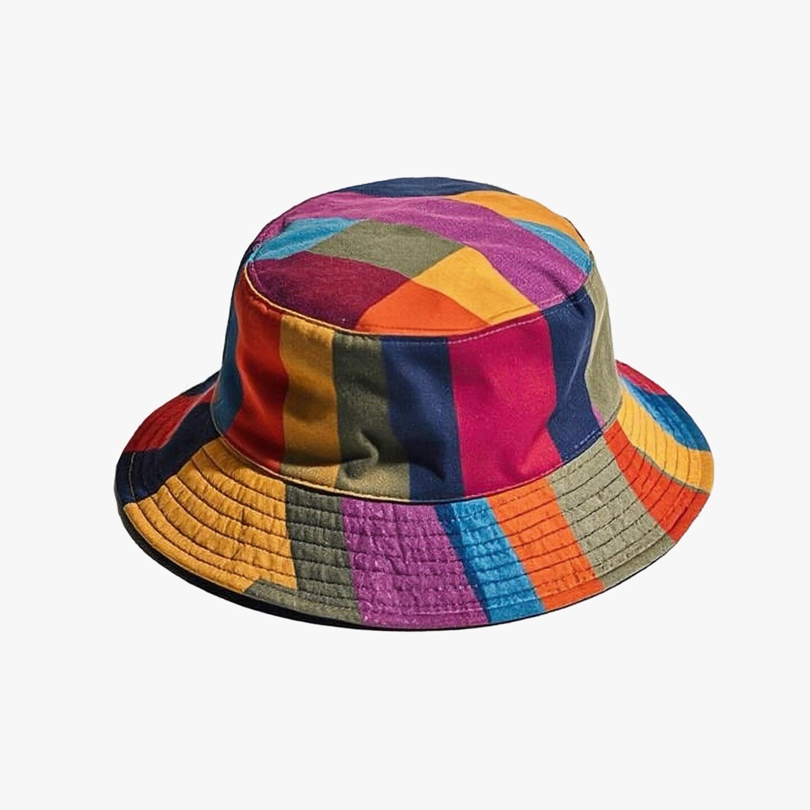
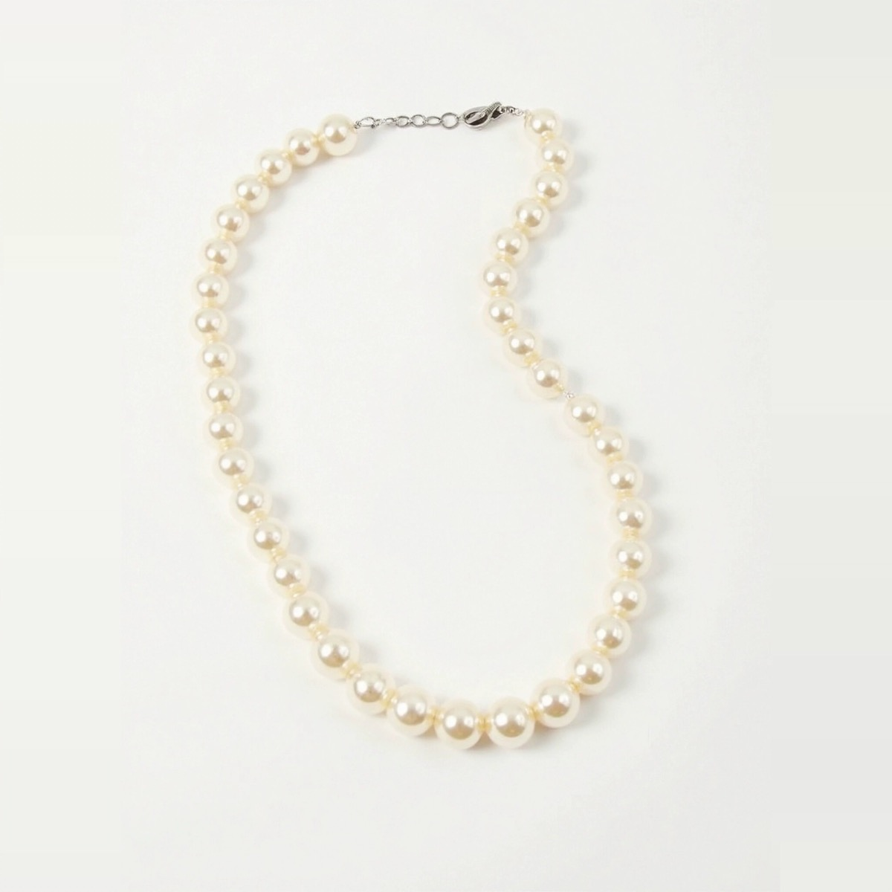
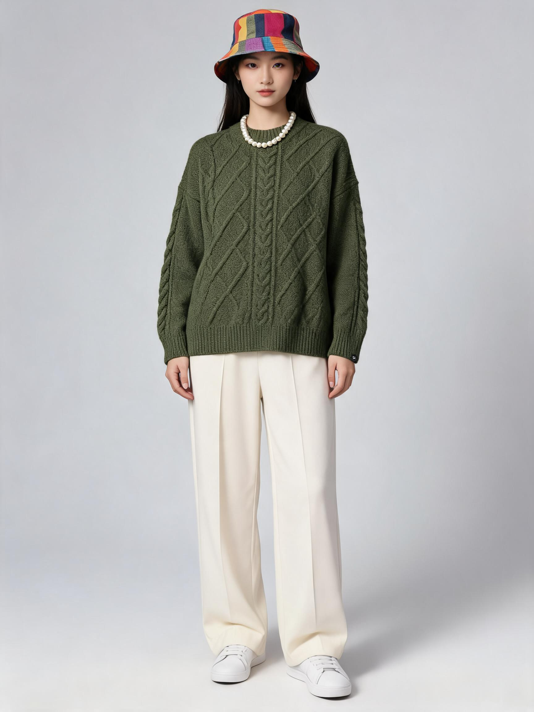

# image-fusion — 多单品自由搭配融图

一次给**最多 8 张单品图**，融合成同一个模特身上的**一整套 Look**。

和 [flat-lay](../flat-lay/skill.md) 的「多件上身」（只支持上装+下装两张）不同，本技能是**任意品类的自由组合**：毛衣 + 阔腿裤 + 帽子 + 项链 + 包 + 鞋，一次出一张完整搭配图。

---

## 生成效果示例

| 输入单品 1 | 输入单品 2 | 输入单品 3 |
| --- | --- | --- |
|  |  |  |
| `item-sweater.jpg` — 军绿麻花针织毛衣 | `item-hat.jpg` — 彩色编织渔夫帽 | `item-necklace.jpg` — 珍珠项链 |

实际执行的命令：

```bash
dlazy seedream-5.0 \
  --prompt '电商搭配商拍图。将参考图中的多件单品组合到同一个模特身上：图1 的军绿色麻花针织圆领毛衣作为上装，图2 的彩色编织渔夫帽戴在头上，图3 的珍珠项链戴在颈部。每件单品必须与参考图完全一致——颜色、织法纹理、图案、材质与细节都不能改。下装自动补一条米白色阔腿长裤，脚穿白色运动鞋。青年亚洲女模特，正面站姿，全身入画，纯浅灰色摄影棚背景，柔和顶光，真实照片质感，无文字无水印。' \
  --images docs/image-fusion/item-sweater.jpg docs/image-fusion/item-hat.jpg docs/image-fusion/item-necklace.jpg \
  --size 3:4 --resolution 2k \
  --save docs/image-fusion/example-output.jpg
```

**输出**



`example-output.jpg` — 3:4 / 2K，5 credits。三件单品同时到位，毛衣的麻花织法、渔夫帽的编织配色与项链的珠径都被保留；未提供的下装与鞋按 prompt 指定补齐。

---

## 1、能力边界

| 能力 | 说明 |
| --- | --- |
| 单品数量 | 最多 **8 张** |
| 品类组合 | 上装 / 下装 / 外套 / 连衣裙 / 鞋 / 包 / 帽子 / 围巾 / 首饰 任意混搭 |
| 参考图（可选） | 决定模特姿势、拍摄角度、景别、场景与光线 |
| 模特图（可选） | 锁定人脸与身材，多套 Look 保持同一个模特 |
| 缺件自动补齐 | 只给上装时，下装与鞋由模型按风格自动搭配 |

**不做**：不改单品的颜色、图案、材质与版型；不做尺码推荐；不用于伪造他人肖像代言。

---

## 2、输入素材规则

生成前先自检这几条硬性约束：

- 大小：**20KB ~ 15MB**
- 分辨率：**大于 400×400**
- 格式：**jpg / jpeg / png / webp**

本技能的素材约束比其他技能宽：

- 数量：**最多 8 张**
- 大小：**20KB ~ 15MB**
- 分辨率：**不超过 8192×8192**
- 格式：**jpg / jpeg / png / heic / webp**

**输入建议**

| 做法 | 说明 |
| --- | --- |
| ✅ 每张只放一件单品 | 一张图里混着上衣和裤子，模型会分不清该穿哪件 |
| ✅ 纯色/透明背景平铺图 | 干扰最少，颜色最准 |
| ✅ 按穿着顺序传图 | 上装 → 下装 → 外套 → 鞋 → 包 → 配饰，prompt 里的 image N 与之对应 |
| ❌ 同类目重复 | 传两件上衣，模型只会选一件或把它们混在一起 |
| ❌ 已经有人穿着的图 | 会把原模特的身体一起带进来 |

---

## 3、单品清单 → prompt 映射

融图的关键是**逐件点名**：每张图对应一个明确的穿着位置，不点名的单品会被忽略。

```text
图1 → 上装：军绿色麻花针织圆领毛衣（作为上装穿在身上）
图2 → 帽子：彩色编织渔夫帽（戴在头上）
图3 → 项链：珍珠项链（戴在颈部）
未提供 → 下装：自动补米白色阔腿长裤
未提供 → 鞋：自动补白色运动鞋
```

写成 prompt：

```text
将参考图中的多件单品组合到同一个模特身上：
图1 的<单品描述>作为上装，图2 的<单品描述>戴在头上，图3 的<单品描述>戴在颈部。
每件单品必须与参考图完全一致——颜色、织法纹理、图案、材质与细节都不能改。
下装自动补一条<描述>，脚穿<描述>。
```

**层次冲突要显式排序**：同时给外套和上装时写 `图2 的外套敞开穿在图1 的上装外面，露出内搭`，否则模型会二选一。

---

## 4、统一整组视觉

一个店铺往往要出十几套 Look，视觉必须统一，否则详情页看起来像拼凑的。固定这四项：

| 要固定的 | 写法 |
| --- | --- |
| 模特 | 传同一张模特图，或 prompt 里固定 `青年亚洲女模特，鹅蛋脸，中长黑直发` |
| 姿势与景别 | 传同一张参考图，或固定 `正面站姿，全身入画` |
| 背景与光线 | 固定 `纯浅灰色摄影棚背景，柔和顶光` |
| 构图留白 | 固定 `人物居中，头顶留白约画面高度 8%` |

只换单品清单，其余 prompt 一字不改——这样出来的整组图才是一套。

---

## 5、dLazy 工具调用

本技能使用 dLazy 的 **`seedream-5.0`**（支持最多 10 张参考图 + 2K/3K/4K 输出，多单品约束场景下性价比最高：单张 5 credits，适合一个店铺跑几十套 Look）。

### Authentication

All requests require a dLazy API key. The recommended way to authenticate is:

```bash
dlazy login
```

This runs a device-code flow (also works in remote shells) and **automatically saves your API key** to the local CLI config — no manual copy/paste required.

#### Alternative: Set the Key Manually

If you already have an API key, you can save it directly:

```bash
dlazy auth set YOUR_API_KEY
```

The CLI saves the key in your user config directory (`~/.dlazy/config.json` on macOS/Linux, `%USERPROFILE%\.dlazy\config.json` on Windows), with file permissions restricted to your OS user account. You can also supply the key per-invocation via the `DLAZY_API_KEY` environment variable.

#### Getting Your API Key Manually

1. Sign in or create an account at [dlazy.com](https://dlazy.com)
2. Go to [dlazy.com/dashboard/organization/api-key](https://dlazy.com/dashboard/organization/api-key)
3. Copy the key shown in the API Key section

Each key is scoped to your dLazy organization and can be **rotated or revoked at any time** from the same dashboard.

### About & Provenance

- **CLI source code**: [github.com/dlazyai/cli](https://github.com/dlazyai/cli)
- **Maintainer**: dlazyai
- **npm package**: `@dlazy/cli` (pinned to `1.2.3` in this skill's install spec)
- **Homepage**: [dlazy.com](https://dlazy.com)

You can install on demand without persisting a global binary by running:

```bash
npx @dlazy/cli@1.2.3 <command>
```

Or, if you prefer a global install, the skill's `metadata.clawdbot.install` field declares the exact pinned version (`npm install -g @dlazy/cli@1.2.3`). Review the GitHub source before installing.

### How It Works

This skill is a thin client over the dLazy hosted API. When you invoke it:

- Prompts and parameters you provide are sent to the dLazy API endpoint (`api.dlazy.com`) for inference.
- Any local file paths you pass to image / video / audio fields are uploaded to dLazy's media storage (`files.dlazy.com`) so the model can read them — the same flow as any cloud-based generation API.
- Generated output URLs returned by the API are hosted on `files.dlazy.com`.

This is the standard SaaS pattern; the skill itself does not access network or filesystem resources beyond what the dLazy CLI already handles. See [dlazy.com](https://dlazy.com) for the full service terms.

### Usage

**CRITICAL INSTRUCTION FOR AGENT**:
Run the `dlazy seedream-5.0` command to get results.

```bash
dlazy seedream-5.0 -h

Options:
  --prompt <prompt>          Prompt
  --images [images...]       Images [image: url or local path] (max 10)
  --resolution <resolution>  Resolution [default: 2k] (choices: "2k", "3k",
                             "4k")
  --size <size>              Size [default: 16:9] (choices: "1:1", "4:3",
                             "3:4", "16:9", "9:16", "3:2", "2:3", "21:9")
  --dry-run                  Print payload without executing the tool
  --no-wait                  Return generateId immediately for async tasks
  --timeout <seconds>        Max seconds to wait for async completion (default:
                             "1800")
  --input <jsonOrFile>       Inline JSON or @path/to/file.json — merged under
                             flag values (flags win)
  --save <path>              Download the result asset to this local path
                             (mkdir + retry handled for you). A destination
                             path — NOT a response format; for stdout shape use
                             --format
  --batch <n>                Fan-out N parallel runs (cloud tools only)
                             (default: "1")
  -h, --help                 display help for command
```

> Any flag also accepts pipe references — `-` (auto-pick from upstream stdin), `@N` (n-th output), `@N.path` (jsonpath into output), `@*` (all primary values), `@stdin` / `@stdin:path` (whole envelope). See `dlazy --help` for details.

**参数约定（本技能固定用法）**

| 参数 | 取值 | 理由 |
| --- | --- | --- |
| `--images` | `[单品1, 单品2, …, (参考图), (模特图)]`，最多 10 张 | 顺序即 prompt 中的 图1 / 图2 / … |
| `--size` | `3:4`（全身 Look 主图）；`1:1`（方图主图） | 电商竖版为主 |
| `--resolution` | `2k` 日常；`3k`/`4k` 印刷或大图详情 | 2K 已够上架 |
| `--batch` | `2` ~ `4` | 多单品组合随机性大，多出几张挑图 |
| `--save` | `docs/image-fusion/output-look<N>.jpg` | 直接落盘 |

### Output Format

```json
{
  "ok": true,
  "result": {
    "tool": "seedream-5.0",
    "modelId": "seedream-5.0",
    "data": {
      "urls": [
        "https://files.dlazy.com/data/ai/20260817092703-057827edb8aa.jpg"
      ]
    },
    "savedPath": "docs/image-fusion/example-output.jpg"
  }
}
```

> Async tasks (when `--no-wait` is passed) omit `data` and return a `task: { generateId, status }` field instead. Use `dlazy status <generateId> --wait` to poll.

### Command Examples

```bash
# basic call: 三件单品融合
dlazy seedream-5.0 \
  --prompt '电商搭配商拍图。将参考图中的多件单品组合到同一个模特身上：图1 的毛衣作为上装，图2 的帽子戴在头上，图3 的项链戴在颈部。每件单品必须与参考图完全一致——颜色、织法纹理、图案、材质与细节都不能改。青年亚洲女模特，正面站姿，全身入画，纯浅灰色摄影棚背景，柔和顶光，真实照片质感，无文字无水印。' \
  --images docs/image-fusion/item-sweater.jpg docs/image-fusion/item-hat.jpg docs/image-fusion/item-necklace.jpg \
  --size 3:4 --resolution 2k

# complex call: 6 件单品 + 姿势参考图 + 固定模特 + 出 4 张挑图
dlazy seedream-5.0 \
  --prompt '电商搭配商拍图。图1 的上装、图2 的下装、图3 敞开外穿的外套、图4 的鞋、图5 的手提包（左手提）、图6 的帽子，全部穿戴到同一个模特身上，外套敞开露出图1 的内搭。每件单品与参考图完全一致，颜色、图案、材质与版型不能改。图7 是姿势与场景参考，图8 是模特脸，人脸与身材沿用图8。真实照片质感，无文字无水印。' \
  --images docs/image-fusion/top.jpg docs/image-fusion/bottom.jpg docs/image-fusion/coat.jpg docs/image-fusion/shoes.jpg docs/image-fusion/bag.jpg docs/image-fusion/item-hat.jpg docs/image-fusion/pose.jpg docs/image-fusion/model-face.jpg \
  --size 3:4 --resolution 3k \
  --batch 4 --save docs/image-fusion/output-look01.jpg

# 先估价不真跑
dlazy seedream-5.0 --dry-run --prompt '...' --images a.jpg b.jpg --size 3:4
```

### Error Handling

| Code | Error Type                         | Example Message                                                                                                          |
| ---- | ---------------------------------- | ------------------------------------------------------------------------------------------------------------------------ |
| 401  | Unauthorized (No API Key)          | `ok: false, code: "unauthorized", message: "API key is missing or invalid"`                                              |
| 501  | Missing required parameter         | `error: required option '--prompt <prompt>' not specified`                                                                |
| 502  | Local file read error              | `Error: Image file/Video file not found: C:\path\to\your\file`                                                            |
| 503  | API request failed (no balance)    | `ok: false, code: "insufficient_balance"`                                                                                |
| 503  | API request failed (server error)  | `HTTP status code error (500 server crash)`                                                                              |
| 504  | Asynchronous task execution failed | `=== Generation Failed ===` / `{Specific error reason returned by backend, for example "Prompt violates safety policy"}`  |

> **AGENT CRITICAL INSTRUCTION**:
> 1. If the execution result returns `code: "insufficient_balance"`, you MUST explicitly inform the user that their credits are insufficient and guide them to recharge: [https://dlazy.com/dashboard/organization/settings?tab=credits](https://dlazy.com/dashboard/organization/settings?tab=credits)
> 2. If the execution result returns `code: "unauthorized"` or indicates missing API key, you MUST inform the user to get their API key from [https://dlazy.com/dashboard/organization/api-key](https://dlazy.com/dashboard/organization/api-key) and save it using `dlazy auth set <key>` and resume the task.

---

## 6、Prompt 模板

```text
电商搭配商拍图。将参考图中的多件单品组合到同一个模特身上：
图1 的[单品描述]作为[穿着位置]，
图2 的[单品描述][穿着位置]，
图3 的[单品描述][穿着位置]。
[层次关系，例：图3 的外套敞开穿在图1 的上装外面，露出内搭。]

每件单品必须与参考图完全一致——颜色、织法纹理、图案、材质与细节都不能改。
[缺件补齐，例：下装自动补一条米白色阔腿长裤，脚穿白色运动鞋。]

[模特描述]，[姿势与景别]，[背景]，[光线]，真实照片质感，无文字无水印。
```

**按问题追加的修正句**

| 问题 | 追加到 prompt 末尾 |
| --- | --- |
| 某件单品被漏掉 | `务必同时出现全部 N 件单品：<逐件重述一遍>，缺一件视为失败。` |
| 两件单品混色了 | `图1 与图2 是两件独立单品，颜色不得互相污染：图1 保持<色>，图2 保持<色>。` |
| 层次穿错 | `穿着层次由内到外为：图1 → 图3；图3 必须敞开且能看到图1 的领口与前襟。` |
| 图案位置漂移 | `图案定位：<单品>的<图案>位于<位置>，尺寸约<描述>，不得移动或重复。` |
| 整组视觉不统一 | 保持第四节四项固定描述**逐字不变**，只替换单品清单 |

---

## 7、执行流程

1. **拆清单**：列出这套 Look 的每一件单品，去掉同类目重复项，确认不超过 8 件。
2. **排序传图**：按上装 → 下装 → 外套 → 鞋 → 包 → 配饰的顺序，prompt 里的 图N 与 `--images` 顺序严格对应。
3. **点名每一件**：一件一句，写清穿着位置；有层次关系的显式排序。
4. **补齐缺件**：没给下装/鞋就在 prompt 里指定，别让模型自由发挥。
5. **固定整组视觉**（第四节四项），多套 Look 之间只换单品清单。
6. **`--dry-run` 估价** → 真跑 → `--batch 2~4` 挑图，落盘到 `docs/image-fusion/`。
7. **质检**：件数是否齐、颜色是否串、层次是否对、图案位置是否漂移。

---

## 8、常见问题

| 现象 | 原因 | 处理 |
| --- | --- | --- |
| 少穿了一件 | 单品数量多、prompt 没逐件点名 | 逐件点名，并追加「缺一件视为失败」句 |
| 帽子和头发穿模 | 缺少交互描述 | 追加 `头发从帽檐下自然垂落，帽子与头顶贴合无缝隙` |
| 两件单品颜色互串 | 色彩相近 | 追加「颜色不得互相污染」句，写死每件的色名 |
| 外套把内搭全挡住 | 未写层次 | 追加层次排序句，要求露出内搭领口与前襟 |
| 整组图风格不统一 | 每次 prompt 都改了背景/光线 | 固定第四节四项描述逐字不变 |
| 单品数量超过 8 | 超出能力 | 拆成两套 Look，或先用 [image-fusion](./skill.md) 出主体、再用 [wear-everything](../wear-everything/skill.md) 单独加配饰 |

---

## Tips

Visit https://dlazy.com for more information.
